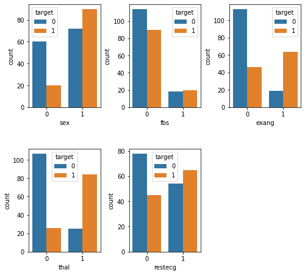

I decided to explore and model the <a href="https://www.kaggle.com/ronitf/heart-disease-uci">Heart Disease UCI dataset</a> from Kaggle. The original source can be found at the <a href="https://archive.ics.uci.edu/ml/datasets/Heart+Disease">UCI Machine Learning Repository</a>. The dataset contains 303 individuals and 14 attribute observations (the original source data contains additional features). The features included various heart disease-related measurements, like chest pain and resting ECG, as well as age and sex, and represented a mix of binary, categorical, ordinal, and numeric data. The outcome variable represented the presence or absence of heart disease.

I applied a fairly standard machine learning process, beginning with understanding what the data represented -- this involved looking at the raw data and reading the data dictionary and other documentation -- followed by splitting the data into training and test sets, Exploratory Data Analysis to understand how the features relate to the outcome, feature encoding, model fitting (logistic regression), and model evaluation.

Ultimately, the model was 75% accurate in predicting heart disease. It correctly predicted 46 out of the 61 test cases. Of the errors it made, 5 were false-positive errors and 10 were false-negative errors.


# Imports


```python
import pandas as pd
import numpy as np
import seaborn as sns
from matplotlib import pyplot as plt
from sklearn.model_selection import train_test_split
import kaggle

# Download data from Kaggle
# !kaggle datasets download ronitf/heart-disease-uci -f heart.csv -p heart_uci
```


```python
df = pd.read_csv('heart.csv')
df.head()
```


<div>
<style scoped>
    .dataframe tbody tr th:only-of-type {
        vertical-align: middle;
    }

    .dataframe tbody tr th {
        vertical-align: top;
    }

    .dataframe thead th {
        text-align: right;
    }
</style>
<table border="1" class="dataframe">
  <thead>
    <tr style="text-align: right;">
      <th></th>
      <th>age</th>
      <th>sex</th>
      <th>cp</th>
      <th>trestbps</th>
      <th>chol</th>
      <th>fbs</th>
      <th>restecg</th>
      <th>thalach</th>
      <th>exang</th>
      <th>oldpeak</th>
      <th>slope</th>
      <th>ca</th>
      <th>thal</th>
      <th>target</th>
    </tr>
  </thead>
  <tbody>
    <tr>
      <th>0</th>
      <td>63</td>
      <td>1</td>
      <td>3</td>
      <td>145</td>
      <td>233</td>
      <td>1</td>
      <td>0</td>
      <td>150</td>
      <td>0</td>
      <td>2.3</td>
      <td>0</td>
      <td>0</td>
      <td>1</td>
      <td>1</td>
    </tr>
    <tr>
      <th>1</th>
      <td>37</td>
      <td>1</td>
      <td>2</td>
      <td>130</td>
      <td>250</td>
      <td>0</td>
      <td>1</td>
      <td>187</td>
      <td>0</td>
      <td>3.5</td>
      <td>0</td>
      <td>0</td>
      <td>2</td>
      <td>1</td>
    </tr>
    <tr>
      <th>2</th>
      <td>41</td>
      <td>0</td>
      <td>1</td>
      <td>130</td>
      <td>204</td>
      <td>0</td>
      <td>0</td>
      <td>172</td>
      <td>0</td>
      <td>1.4</td>
      <td>2</td>
      <td>0</td>
      <td>2</td>
      <td>1</td>
    </tr>
    <tr>
      <th>3</th>
      <td>56</td>
      <td>1</td>
      <td>1</td>
      <td>120</td>
      <td>236</td>
      <td>0</td>
      <td>1</td>
      <td>178</td>
      <td>0</td>
      <td>0.8</td>
      <td>2</td>
      <td>0</td>
      <td>2</td>
      <td>1</td>
    </tr>
    <tr>
      <th>4</th>
      <td>57</td>
      <td>0</td>
      <td>0</td>
      <td>120</td>
      <td>354</td>
      <td>0</td>
      <td>1</td>
      <td>163</td>
      <td>1</td>
      <td>0.6</td>
      <td>2</td>
      <td>0</td>
      <td>2</td>
      <td>1</td>
    </tr>
  </tbody>
</table>
</div>


When I started to explore the data, I noticed that many of the parameters that I would expect from my lay knowledge of heart disease to be positively correlated, were actually pointed in the opposite direction. After reading through some comments in the Kaggle discussion forum, I discovered that others had come to a similar conclusion: the target variable was reversed.

So here I flip it back to how it should be (1 = heart disease; 0 = no heart disease).


```python
df.target = df.target.replace({0:1, 1:0})
```

I'll check the target classes to see how balanced they are.


```python
df.target.value_counts()
```


    0    165
    1    138
    Name: target, dtype: int64


Not particularly unbalanced, but we'll stratify in the train-test split later anyway.

# Feature descriptions

First I'll put the features into groups based on the type of data contained. In order to make these groupings, I've used the data dictionary, as well as some helpful comments on Kaggle notebooks and discussion. Some of the documentation turned out to be incorrect, as I learned in my own examination of the data dictionary and confirmed by reading discussions on Kaggle. For example, the target was coded incorrectly (originally, 0 was "had heart disease"), and many of the categorical variable labels were missing.

## Binary
* `sex` (0 = female; 1 = male)
* `fbs`: Fasting blood sugar > 120 mg/dl
* `exang`: Exercise induced angina (0 = no; 1 = yes)

## Categorical
* `cp`: Chest pain type (0 = Asymptomatic angina; 1 = Atypical angina; 2 = Non-angina; 3 = Typical angina)
* `restecg`: Resting ECG (0 = Left ventricular hypertrophy; 1 = Normal; 2 = ST-T wave abnormality)
* `slope`: Slope of the peak exercise ST segment (0 = downsloping; 1 = upsloping; 2 = flat)
* `thal`: Thalium stress test result (0 = NA; 1 = Fixed defect; 2 = Normal; 3 = Reversible defect)

## Ordinal
* `ca`: number of major vessels (0-3) colored by flourosopy

## Numeric
* `age`
* `oldpeak`: ST depression induced by exercise relative to rest
* `trestbps`: Resting blood pressure
* `chol`: Serum cholestoral in mg/dl
* `thalach`: Maximum heart rate achieved during thalium stress test

## Target
* `target`: 1 = heart disease; 0 = no heart disease

I'll create arrays so the features are easier to access later by type.


```python
bins = ['sex', 'fbs', 'exang']
cats = ['cp', 'restecg', 'slope', 'thal']
ords = ['ca']
nums = ['age', 'oldpeak', 'trestbps', 'chol', 'thalach']
target = ['target']
```

I'll recode the categorical variables so the data exploration is easier.


```python
df.cp = df.cp.replace({0:'Asympt.', 1:'Atypical', 2:'Non', 3:'Typical'})
df.restecg = df.restecg.replace({0:'LV hyper', 1:'Normal', 2:'ST-T wave'})
df.slope = df.slope.replace({0:'down', 1:'up', 2:'flat'})
df.thal = df.thal.replace({0:'NA', 1:'Fixed', 2:'Normal', 3:'Revers.'})
```

# Train-test split

Before exploring the data, I'll split them into train and test sets.


```python
X_train, X_test, y_train, y_test = train_test_split(df,
                                                    df.target,
                                                    test_size = 0.2,
                                                    random_state = 42,
                                                    stratify = df.target)
```

# Exploratory data analysis

## Numeric and ordinal descriptives


```python
X_train[X_train.target == 0].drop(cats + bins + target,
                                  axis=1).describe().loc[['mean', 'std']]
```


<div>
<style scoped>
    .dataframe tbody tr th:only-of-type {
        vertical-align: middle;
    }

    .dataframe tbody tr th {
        vertical-align: top;
    }

    .dataframe thead th {
        text-align: right;
    }
</style>
<table border="1" class="dataframe">
  <thead>
    <tr style="text-align: right;">
      <th></th>
      <th>age</th>
      <th>trestbps</th>
      <th>chol</th>
      <th>thalach</th>
      <th>oldpeak</th>
      <th>ca</th>
    </tr>
  </thead>
  <tbody>
    <tr>
      <th>mean</th>
      <td>52.598485</td>
      <td>129.000000</td>
      <td>247.340909</td>
      <td>158.280303</td>
      <td>0.585606</td>
      <td>0.30303</td>
    </tr>
    <tr>
      <th>std</th>
      <td>9.366058</td>
      <td>16.414944</td>
      <td>56.661824</td>
      <td>18.929082</td>
      <td>0.759282</td>
      <td>0.73036</td>
    </tr>
  </tbody>
</table>
</div>


```python
X_train[X_train.target == 1].drop(cats + bins + target,
                                  axis=1).describe().loc[['mean', 'std']]
```


<div>
<style scoped>
    .dataframe tbody tr th:only-of-type {
        vertical-align: middle;
    }

    .dataframe tbody tr th {
        vertical-align: top;
    }

    .dataframe thead th {
        text-align: right;
    }
</style>
<table border="1" class="dataframe">
  <thead>
    <tr style="text-align: right;">
      <th></th>
      <th>age</th>
      <th>trestbps</th>
      <th>chol</th>
      <th>thalach</th>
      <th>oldpeak</th>
      <th>ca</th>
    </tr>
  </thead>
  <tbody>
    <tr>
      <th>mean</th>
      <td>56.554545</td>
      <td>134.236364</td>
      <td>252.190909</td>
      <td>139.718182</td>
      <td>1.616364</td>
      <td>1.090909</td>
    </tr>
    <tr>
      <th>std</th>
      <td>8.085082</td>
      <td>18.436067</td>
      <td>49.041547</td>
      <td>21.377400</td>
      <td>1.314669</td>
      <td>1.018593</td>
    </tr>
  </tbody>
</table>
</div>


Here we see that individuals with heart disease are/have...

- Older [`age`]
- Higher resting blood pressure [`trestbps`]
- Higher cholesterol [`chol`]
- Lower maximum heart rate [`thalach`]
- Higher exercise-induced ST depression [`oldpeak`]
- More vessels colored by fluoroscopy [`ca`]

## Categorical and boolean counts

### Categorical


```python
fig = plt.figure(figsize=(8, 6))
fig.subplots_adjust(hspace=0.4, wspace=0.4, bottom=0.01, top=0.95)

for i, var in enumerate(cats):
    i = i + 1
    ax = fig.add_subplot(2, 2, i)
    ax.set_xticklabels(ax.get_xticklabels(), rotation=45)
    sns.countplot(data = X_train, x = var, hue = 'target', ax = ax)

plt.show()
```


Here we see that individuals with heart disease are/have...

- More likely to present with asymptomatic angina [`cp`]
- Less likely to present with atypical or no angina [`cp`]
- Less likely to present with normal resting ECG [`restecg`]
- More likely to present with an up slope [`slope`]
- Less likely to present with a flat slope [`slope`]
- More likely to preset with a reversible defect [`thal`]
- Less likely to present with a normal result on the thalium test [`thal`]

#### Combining sparse classes

Some of the categorical feature classes are sparse. There are instances where it might also make conceptual sense to collapse them. For example, the resting ECG test [`restecg`] has values that essentially correspond with "normal" and "abnormal". The "ST-T wave" class is relatively rare, but it behaves similar to "LV hyper". So this is a case where it might make sense to collapse the two abnormal classes.


```python
df.restecg = df.restecg.replace({'Normal':0, 'LV hyper':1, 'ST-T wave':1})
df.thal = df.thal.replace({'NA':0, 'Normal':0, 'Fixed': 1, 'Revers.': 1})
X_train, X_test, y_train, y_test = train_test_split(df,
                                                    df.target,
                                                    test_size = 0.2,
                                                    random_state = 42,
                                                    stratify = df.target)
```

We'll also re-classify the features for which we just now collapsed classes to binary, and remove them from the categorical feature list.


```python
bins = ['sex', 'fbs', 'exang', 'thal', 'restecg']
cats = ['cp', 'slope']
```

### Binary


```python
fig = plt.figure(figsize=(8, 6))
fig.subplots_adjust(hspace=0.4, wspace=0.4, bottom=0.01, top=0.95)

for i, var in enumerate(bins):
    i = i + 1
    ax = fig.add_subplot(2, 3, i)
    sns.countplot(data = X_train, x = var, hue = 'target', ax = ax)

plt.show()
```





Here we see that individuals with heart disease are/have...

- More likely to be male [`sex`]
- Less likely to present with fbs <= 120 mg/dl [`fbs`]
- More likely to experience exercise-induced angina [`exang`]
- More likely to have an abnormal reading on the thalium test [`thal`]
- Less likely to have a normal reading on the resting ECG test [`restecg`]

# Feature encoding

Next, we'll need to encode the variables. For the numeric variables [`nums`] we'll use a StandardScaler. This will "mean center" the variable such that it has a mean of 0 and an SD of 1. Each value will then represent a stnadardized difference from the mean. For the categorical variables [`cats`], we'll use one-hot encoding. This creates N-1 new columns for each of the values represented in a feature, and those new columns contain binary values to encode presence or absence of the feature-value.


```python
from sklearn.preprocessing import StandardScaler, OneHotEncoder
from sklearn.compose import make_column_transformer
clt = make_column_transformer(
    (StandardScaler(), nums),
    (OneHotEncoder(), cats)
)

clt.fit(X_train)
X_train_transformed = clt.transform(X_train)
X_test_transformed = clt.transform(X_test)
```

# Logistic regression

Side-note: When I tried fitting a Logistic Regression model to the data before standardizing the numeric variables in the previous step, it would not converge. If it had converged, it probably would have given too much weight to those variables.

## Fit the model


```python
from sklearn.linear_model import LogisticRegression
lr = LogisticRegression()
lr.fit(X_train_transformed, y_train)
```


    LogisticRegression(C=1.0, class_weight=None, dual=False, fit_intercept=True,
                       intercept_scaling=1, l1_ratio=None, max_iter=100,
                       multi_class='auto', n_jobs=None, penalty='l2',
                       random_state=None, solver='lbfgs', tol=0.0001, verbose=0,
                       warm_start=False)


## Score the model


```python
lr.score(X_test_transformed, y_test)
```


    0.7540983606557377


75% is not terrible, but not terribly great either. Generally 80% and above is considered acceptable, though of course it depends on the application, and specific kinds of errors might be important here. We fell short of this rule of thumb but not by a huge margin.

## Confusion matrix


```python
from sklearn.metrics import confusion_matrix
y_pred = lr.predict(X_test_transformed)
confusion_matrix = confusion_matrix(y_test, y_pred)
confusion_matrix
```


    array([[28,  5],
           [10, 18]])


Here we can see where the mistakes were made. We made 46 (28+18) correct predictions and 15 (10+5) incorrect predictions. 5 errors were false-positive errors and 10 were false-negative errors. Depending on how we plan to use this data, one of these types of errors might be more important than the other. For example, maybe we want to minimize false-negatives, because we don't want to run the risk of missing a diagnosis and taking proactive measures to treat it.


<script src="https://giscus.app/client.js"
        data-repo="tylerburleigh/tylerburleigh.github.io"
        data-repo-id="R_kgDOKMo8ww"
        data-category="Blog comments"
        data-category-id="DIC_kwDOIg6EJc4CSz92"
        data-mapping="pathname"
        data-strict="0"
        data-reactions-enabled="1"
        data-emit-metadata="0"
        data-input-position="bottom"
        data-theme="light"
        data-lang="en"
        crossorigin="anonymous"
        async>
</script>
