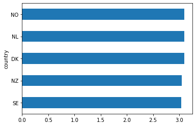
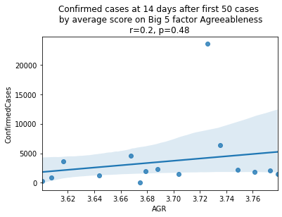
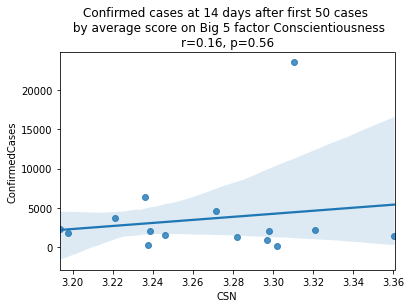
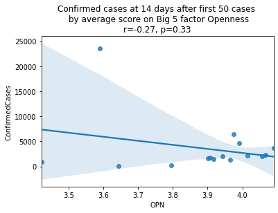
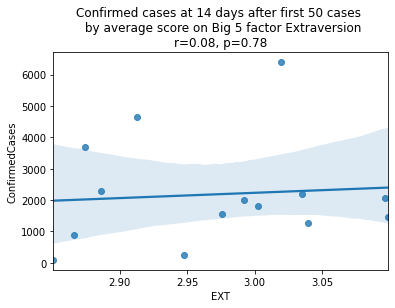
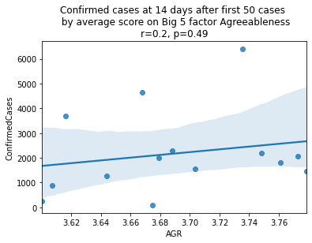
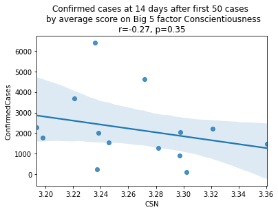

Here I pose the following question:

> Does the growth in COVID-19 cases have anything to do with Big 5 Personality traits?

To answer this question, I will need country-level aggregates on the Big 5 test, and a country-level aggregate that represents for "growth" over time in coronavirus cases.

Here's how I operationalize it: I take all the countries that reached at least 50 "confirmed cases" of the coronavirus, using data that's up to date as of March 20, 2020. Then I take the number of cases those countries had 14-days after reaching 50 confirmed cases. This gives an estimate of growth within a country that can be compared across countries, because it puts them all on a level playing-field.

Next, I compute country-level averages on the Big 5 Personality Test using data from the Open Source Psychometrics Project, and I only include countries with at least 1000 observations.

Finally, I look at the correlation between Confirmed Cases at Day 14 and average scores on each of the Big 5 personality traits (openness, conscientiousness, extraversion, agreeableness, neuroticism [a.k.a. emotional stability]).

For easy reference, the following datasets are used:

- [COVID19 Global Forecasting (Week 1)](https://www.kaggle.com/c/covid19-global-forecasting-week-1/data)
- [Big Five Personality Test](https://www.kaggle.com/tunguz/big-five-personality-test)
- [Countries ISO Codes](https://www.kaggle.com/juanumusic/countries-iso-codes)


```python
import pandas as pd
import numpy as np
import seaborn as sns
from matplotlib import pyplot as plt
from scipy.stats import pearsonr
import kaggle
```

# COVID-19 Data

For the COVID-19 data, we'll get the number of cases at 2-weeks after the first 50 confirmed cases.


```python
# Download data from kaggle
# !kaggle competitions download -f train.csv covid19-global-forecasting-week-1
# !kaggle competitions download -f test.csv covid19-global-forecasting-week-1

# Join the training and test sets
covid19 = pd.concat([pd.read_csv('train.csv'), pd.read_csv('test.csv')])
# Sort by date
covid19.sort_values('Date')
# Filter to the columns we need
covid19 = covid19.loc[:, ['Country/Region', 'Date', 'ConfirmedCases']]

covid19.head()
```


<div>
<style scoped>
    .dataframe tbody tr th:only-of-type {
        vertical-align: middle;
    }

    .dataframe tbody tr th {
        vertical-align: top;
    }

    .dataframe thead th {
        text-align: right;
    }
</style>
<table border="1" class="dataframe">
  <thead>
    <tr style="text-align: right;">
      <th></th>
      <th>Country/Region</th>
      <th>Date</th>
      <th>ConfirmedCases</th>
    </tr>
  </thead>
  <tbody>
    <tr>
      <th>0</th>
      <td>Afghanistan</td>
      <td>2020-01-22</td>
      <td>0.0</td>
    </tr>
    <tr>
      <th>1</th>
      <td>Afghanistan</td>
      <td>2020-01-23</td>
      <td>0.0</td>
    </tr>
    <tr>
      <th>2</th>
      <td>Afghanistan</td>
      <td>2020-01-24</td>
      <td>0.0</td>
    </tr>
    <tr>
      <th>3</th>
      <td>Afghanistan</td>
      <td>2020-01-25</td>
      <td>0.0</td>
    </tr>
    <tr>
      <th>4</th>
      <td>Afghanistan</td>
      <td>2020-01-26</td>
      <td>0.0</td>
    </tr>
  </tbody>
</table>
</div>


## Filter

Next we'll filter to countries that reached at least 50 confirmed cases, and had at least 14 days of data beyond reaching that point.


```python
covid19 = covid19[covid19.ConfirmedCases > 50]
covid19_numdays = covid19.loc[:, ['Country/Region', 'Date']]\
    .drop_duplicates()\
    .groupby('Country/Region')\
    .count()\
    .rename_axis('country')\
    .reset_index()
print(covid19_numdays.head())

covid19_mindays = covid19_numdays[covid19_numdays.Date >= 14].reset_index()
covid19 = covid19[covid19['Country/Region'].isin(covid19_mindays.country)].reset_index()
```

         country  Date
    0    Albania     5
    1    Algeria     5
    2    Andorra     2
    3  Argentina     5
    4    Armenia     5


What/how many countries does that leave us with?


```python
print(len(list(set(covid19['Country/Region'].values))))
print(set(covid19['Country/Region'].values))
```

    21
    {'Cruise Ship', 'Spain', 'United Kingdom', 'Singapore', 'Sweden', 'Kuwait', 'Bahrain', 'Germany', 'Iraq', 'Austria', 'Korea, South', 'Norway', 'China', 'Netherlands', 'Belgium', 'France', 'Malaysia', 'Switzerland', 'Iran', 'Japan', 'Italy'}


Obviously "Cruise Ship" isn't a country. I won't worry about it at this point, since it will get filtered out in later steps.

## Compute growth over 14 days

Next, we'll compute the growth in cases for each country, from the date they reached 50 Confirmed Cases to the 14th day following that date. First we'll need to collapse over province, since some countries are represented multiple times under different provinces.


```python
covid19[covid19['Country/Region'] == 'China'].head()
```


<div>
<style scoped>
    .dataframe tbody tr th:only-of-type {
        vertical-align: middle;
    }

    .dataframe tbody tr th {
        vertical-align: top;
    }

    .dataframe thead th {
        text-align: right;
    }
</style>
<table border="1" class="dataframe">
  <thead>
    <tr style="text-align: right;">
      <th></th>
      <th>index</th>
      <th>Country/Region</th>
      <th>Date</th>
      <th>ConfirmedCases</th>
    </tr>
  </thead>
  <tbody>
    <tr>
      <th>47</th>
      <td>2777</td>
      <td>China</td>
      <td>2020-01-26</td>
      <td>60.0</td>
    </tr>
    <tr>
      <th>48</th>
      <td>2778</td>
      <td>China</td>
      <td>2020-01-27</td>
      <td>70.0</td>
    </tr>
    <tr>
      <th>49</th>
      <td>2779</td>
      <td>China</td>
      <td>2020-01-28</td>
      <td>106.0</td>
    </tr>
    <tr>
      <th>50</th>
      <td>2780</td>
      <td>China</td>
      <td>2020-01-29</td>
      <td>152.0</td>
    </tr>
    <tr>
      <th>51</th>
      <td>2781</td>
      <td>China</td>
      <td>2020-01-30</td>
      <td>200.0</td>
    </tr>
  </tbody>
</table>
</div>


```python
covid19_collapse_province = covid19\
    .groupby(['Country/Region', 'Date'])\
    .sum()\
    .reset_index()
covid19_collapse_province[covid19_collapse_province['Country/Region'] == 'China'].head()
```


<div>
<style scoped>
    .dataframe tbody tr th:only-of-type {
        vertical-align: middle;
    }

    .dataframe tbody tr th {
        vertical-align: top;
    }

    .dataframe thead th {
        text-align: right;
    }
</style>
<table border="1" class="dataframe">
  <thead>
    <tr style="text-align: right;">
      <th></th>
      <th>Country/Region</th>
      <th>Date</th>
      <th>index</th>
      <th>ConfirmedCases</th>
    </tr>
  </thead>
  <tbody>
    <tr>
      <th>47</th>
      <td>China</td>
      <td>2020-01-22</td>
      <td>3540</td>
      <td>444.0</td>
    </tr>
    <tr>
      <th>48</th>
      <td>China</td>
      <td>2020-01-23</td>
      <td>3541</td>
      <td>444.0</td>
    </tr>
    <tr>
      <th>49</th>
      <td>China</td>
      <td>2020-01-24</td>
      <td>6612</td>
      <td>602.0</td>
    </tr>
    <tr>
      <th>50</th>
      <td>China</td>
      <td>2020-01-25</td>
      <td>14172</td>
      <td>958.0</td>
    </tr>
    <tr>
      <th>51</th>
      <td>China</td>
      <td>2020-01-26</td>
      <td>26818</td>
      <td>1628.0</td>
    </tr>
  </tbody>
</table>
</div>


```python
covid19 = covid19_collapse_province\
    .groupby('Country/Region')\
    .head(14)\
    .groupby('Country/Region')\
    .tail(1)

covid19
```


<div>
<style scoped>
    .dataframe tbody tr th:only-of-type {
        vertical-align: middle;
    }

    .dataframe tbody tr th {
        vertical-align: top;
    }

    .dataframe thead th {
        text-align: right;
    }
</style>
<table border="1" class="dataframe">
  <thead>
    <tr style="text-align: right;">
      <th></th>
      <th>Country/Region</th>
      <th>Date</th>
      <th>index</th>
      <th>ConfirmedCases</th>
    </tr>
  </thead>
  <tbody>
    <tr>
      <th>13</th>
      <td>Austria</td>
      <td>2020-03-19</td>
      <td>1060</td>
      <td>2013.0</td>
    </tr>
    <tr>
      <th>28</th>
      <td>Bahrain</td>
      <td>2020-03-17</td>
      <td>1176</td>
      <td>228.0</td>
    </tr>
    <tr>
      <th>45</th>
      <td>Belgium</td>
      <td>2020-03-19</td>
      <td>1414</td>
      <td>1795.0</td>
    </tr>
    <tr>
      <th>60</th>
      <td>China</td>
      <td>2020-02-04</td>
      <td>90949</td>
      <td>23524.0</td>
    </tr>
    <tr>
      <th>119</th>
      <td>Cruise Ship</td>
      <td>2020-02-20</td>
      <td>5103</td>
      <td>634.0</td>
    </tr>
    <tr>
      <th>162</th>
      <td>France</td>
      <td>2020-03-12</td>
      <td>6009</td>
      <td>2281.0</td>
    </tr>
    <tr>
      <th>184</th>
      <td>Germany</td>
      <td>2020-03-13</td>
      <td>6718</td>
      <td>3675.0</td>
    </tr>
    <tr>
      <th>205</th>
      <td>Iran</td>
      <td>2020-03-08</td>
      <td>7657</td>
      <td>6566.0</td>
    </tr>
    <tr>
      <th>231</th>
      <td>Iraq</td>
      <td>2020-03-20</td>
      <td>7728</td>
      <td>208.0</td>
    </tr>
    <tr>
      <th>245</th>
      <td>Italy</td>
      <td>2020-03-06</td>
      <td>7891</td>
      <td>4636.0</td>
    </tr>
    <tr>
      <th>273</th>
      <td>Japan</td>
      <td>2020-02-29</td>
      <td>8003</td>
      <td>241.0</td>
    </tr>
    <tr>
      <th>307</th>
      <td>Korea, South</td>
      <td>2020-03-04</td>
      <td>8302</td>
      <td>5621.0</td>
    </tr>
    <tr>
      <th>337</th>
      <td>Kuwait</td>
      <td>2020-03-15</td>
      <td>8431</td>
      <td>112.0</td>
    </tr>
    <tr>
      <th>356</th>
      <td>Malaysia</td>
      <td>2020-03-19</td>
      <td>8907</td>
      <td>900.0</td>
    </tr>
    <tr>
      <th>371</th>
      <td>Netherlands</td>
      <td>2020-03-18</td>
      <td>9909</td>
      <td>2051.0</td>
    </tr>
    <tr>
      <th>387</th>
      <td>Norway</td>
      <td>2020-03-17</td>
      <td>10144</td>
      <td>1463.0</td>
    </tr>
    <tr>
      <th>404</th>
      <td>Singapore</td>
      <td>2020-02-26</td>
      <td>11481</td>
      <td>93.0</td>
    </tr>
    <tr>
      <th>441</th>
      <td>Spain</td>
      <td>2020-03-14</td>
      <td>11793</td>
      <td>6391.0</td>
    </tr>
    <tr>
      <th>461</th>
      <td>Sweden</td>
      <td>2020-03-18</td>
      <td>12033</td>
      <td>1279.0</td>
    </tr>
    <tr>
      <th>477</th>
      <td>Switzerland</td>
      <td>2020-03-16</td>
      <td>12090</td>
      <td>2200.0</td>
    </tr>
    <tr>
      <th>495</th>
      <td>United Kingdom</td>
      <td>2020-03-16</td>
      <td>16456</td>
      <td>1543.0</td>
    </tr>
  </tbody>
</table>
</div>


# Country Abbreviations

Next we'll join in the country abbreviation codes. The source data here comes from the Kaggle [Countries ISO Codes dataset](https://www.kaggle.com/juanumusic/countries-iso-codes), and the original source is Wikipedia. This will allow us to join to the Big 5 dataset later.


```python
# !kaggle datasets download juanumusic/countries-iso-codes -f wikipedia-iso-country-codes.csv
country_isos = pd.read_csv('wikipedia-iso-country-codes.csv')
country_isos = country_isos.rename(columns={"English short name lower case": "Country/Region",
                                            "Alpha-2 code": "country_abbr"})
country_isos = country_isos.loc[:, ['Country/Region', 'country_abbr']]
country_isos.head()
```


<div>
<style scoped>
    .dataframe tbody tr th:only-of-type {
        vertical-align: middle;
    }

    .dataframe tbody tr th {
        vertical-align: top;
    }

    .dataframe thead th {
        text-align: right;
    }
</style>
<table border="1" class="dataframe">
  <thead>
    <tr style="text-align: right;">
      <th></th>
      <th>Country/Region</th>
      <th>country_abbr</th>
    </tr>
  </thead>
  <tbody>
    <tr>
      <th>0</th>
      <td>Afghanistan</td>
      <td>AF</td>
    </tr>
    <tr>
      <th>1</th>
      <td>Åland Islands</td>
      <td>AX</td>
    </tr>
    <tr>
      <th>2</th>
      <td>Albania</td>
      <td>AL</td>
    </tr>
    <tr>
      <th>3</th>
      <td>Algeria</td>
      <td>DZ</td>
    </tr>
    <tr>
      <th>4</th>
      <td>American Samoa</td>
      <td>AS</td>
    </tr>
  </tbody>
</table>
</div>


```python
covid19 = covid19.merge(country_isos, left_on='Country/Region', right_on='Country/Region')
covid19 = covid19.dropna()
covid19.head()
```


<div>
<style scoped>
    .dataframe tbody tr th:only-of-type {
        vertical-align: middle;
    }

    .dataframe tbody tr th {
        vertical-align: top;
    }

    .dataframe thead th {
        text-align: right;
    }
</style>
<table border="1" class="dataframe">
  <thead>
    <tr style="text-align: right;">
      <th></th>
      <th>Country/Region</th>
      <th>Date</th>
      <th>index</th>
      <th>ConfirmedCases</th>
      <th>country_abbr</th>
    </tr>
  </thead>
  <tbody>
    <tr>
      <th>0</th>
      <td>Austria</td>
      <td>2020-03-19</td>
      <td>1060</td>
      <td>2013.0</td>
      <td>AT</td>
    </tr>
    <tr>
      <th>1</th>
      <td>Bahrain</td>
      <td>2020-03-17</td>
      <td>1176</td>
      <td>228.0</td>
      <td>BH</td>
    </tr>
    <tr>
      <th>2</th>
      <td>Belgium</td>
      <td>2020-03-19</td>
      <td>1414</td>
      <td>1795.0</td>
      <td>BE</td>
    </tr>
    <tr>
      <th>3</th>
      <td>China</td>
      <td>2020-02-04</td>
      <td>90949</td>
      <td>23524.0</td>
      <td>CN</td>
    </tr>
    <tr>
      <th>4</th>
      <td>France</td>
      <td>2020-03-12</td>
      <td>6009</td>
      <td>2281.0</td>
      <td>FR</td>
    </tr>
  </tbody>
</table>
</div>


# Big Five Personality Data

Next, we'll fetch the [Big Five Personality Test data from Kaggle](https://www.kaggle.com/tunguz/big-five-personality-test). This dataset contains ~1M answers collected online by [Open Psychometrics](https://openpsychometrics.org/tests/IPIP-BFFM). I'm interested in this dataset because it also labels the country in which the respondant is located. We can use this dataset to get country-level aggregate data on personality traits, and then see if those traits map onto the COVID-19 outcomes that we're seeing.


```python
# Download data from Kaggle
# !kaggle datasets download tunguz/big-five-personality-test -f IPIP-FFM-data-8Nov2018/data-final.csv

# The file was zipped because it was so big, so unzip it
# import zipfile
# with zipfile.ZipFile('data-final.csv.zip', 'r') as zip_ref:
#     zip_ref.extractall()

big5 = pd.read_csv('data-final.csv', sep='\t')
```

## Scoring the Big Five Personality Test items

The Big 5 personality inventory contains 5 factors. Like most personality scales, the Big 5 has a mix of items that positively and negatively load onto these personality factors. For example, the factor Extraversion describes someone who is outgoing, energetic, talkative, and enjoys human interaction. The first Extraversion item [`EXT1`] is "I am the life of the party.", a positively-keyed item; whereas the second item [`EXT2`] is "I don't talk a lot.", a negatively-keyed item.

To find out which items are positively or negatively keyed, we can look at the scale documentation on the IPIP website: https://ipip.ori.org/newBigFive5broadKey.htm

## Reverse-coding

Before analyzing the data from a personality test, a psychologist will generally "reverse-code" the items that are negatively-keyed. This results in a dataset where the item values all have a common direction and interpretetion (i.e., a higher value corresponds with more of that trait). Mathematically, it allows you to then compute sums and averages for each of the factors. For example, after scoring the test items, we could compute an individual's average for Extraversion items to get their Extraversion score.

This version of the Big 5 scale asks individuals to rate their level of agreement from 1 to 5, where 1 is strong disagreement and 5 is strong agreement. Reverse-coding is as simple as subtracting 6 from every reverse-keyed item.

The code below will accomplish this task.


```python
positively_keyed = ['EXT1', 'EXT3', 'EXT5', 'EXT7', 'EXT9',
                    'EST1', 'EST3', 'EST5', 'EST6', 'EST7', 'EST8', 'EST9', 'EST10',
                    'AGR2', 'AGR4', 'AGR6', 'AGR8', 'AGR9', 'AGR10',
                    'CSN1', 'CSN3', 'CSN5', 'CSN7', 'CSN9', 'CSN10',
                    'OPN1', 'OPN3', 'OPN5', 'OPN7', 'OPN8', 'OPN9', 'OPN10']

negatively_keyed = ['EXT2', 'EXT4', 'EXT6', 'EXT8', 'EXT10',
                    'EST2', 'EST4',
                    'AGR1', 'AGR3', 'AGR5', 'AGR7',
                    'CSN2', 'CSN4', 'CSN6', 'CSN8',
                    'OPN2', 'OPN4', 'OPN6']
```


```python
big5.loc[:, negatively_keyed] = 6 - big5.loc[:, negatively_keyed]
```

## Country-Level Big 5 Aggregates

First, we should eliminate any country that doesn't have very many observations. Somewhat arbitrarily, we'll draw a line at N = 1000.


```python
big5_country_count = big5.country\
    .value_counts()\
    .rename_axis('country')\
    .reset_index(name='counts')

print(len(big5_country_count[big5_country_count.counts > 1000]))
print(big5_country_count[big5_country_count.counts > 1000].country.values)
```

    58
    ['US' 'GB' 'CA' 'AU' 'PH' 'IN' 'DE' 'NONE' 'NZ' 'NO' 'MY' 'MX' 'SE' 'NL'
     'SG' 'ID' 'BR' 'FR' 'DK' 'IE' 'IT' 'ES' 'PL' 'FI' 'RO' 'BE' 'ZA' 'CO'
     'HK' 'PK' 'RU' 'AR' 'CH' 'AE' 'TR' 'PT' 'GR' 'VN' 'HR' 'AT' 'CL' 'RS'
     'CZ' 'TH' 'JP' 'PE' 'KR' 'HU' 'IL' 'KE' 'CN' 'BG' 'VE' 'EC' 'LT' 'SA'
     'EG' 'EE']


There are 58 countries with at least 1000 observations. Let's go with these.


```python
big5 = big5[big5.country.isin(big5_country_count[big5_country_count.counts > 1000].country.values)]

# Filter on the columns we're going to use
big5 = big5.loc[:,['country'] + positively_keyed + negatively_keyed]
```

### Factor aggregation

Next, we'll compute averages for each of the five factors at the level of the individual.


```python
EXT = ['EXT' + str(i) for i in range(1,11)]
EST = ['EST' + str(i) for i in range(1,11)]
AGR = ['AGR' + str(i) for i in range(1,11)]
CSN = ['CSN' + str(i) for i in range(1,11)]
OPN = ['OPN' + str(i) for i in range(1,11)]
```


```python
big5['EXT'] = big5.loc[:, EXT].mean(axis=1)
big5['EST'] = big5.loc[:, EST].mean(axis=1)
big5['AGR'] = big5.loc[:, AGR].mean(axis=1)
big5['CSN'] = big5.loc[:, CSN].mean(axis=1)
big5['OPN'] = big5.loc[:, OPN].mean(axis=1)
big5 = big5.loc[:, ['country', 'EXT', 'EST', 'AGR', 'CSN', 'OPN']]
```

Drop NAs, and any with country = 'NONE'


```python
big5 = big5.dropna()
big5 = big5[big5.country != 'NONE']
```

### Country-level averages

Now we can calculate the country-level averages.


```python
big5_cavgs = big5.groupby('country')\
                    .mean()\
                    .rename_axis('country')\
                    .reset_index()
```

Just to illustrate, these are the top 5 countries by country-level Extraversion scores.


```python
big5_cavgs.loc[:, ['country', 'EXT']]\
    .sort_values(by=['EXT'])\
    .tail()\
    .plot(x = 'country',
          y = 'EXT',
          kind='barh',
          legend=False)

plt.show()
```





# Joining Big 5 Country Data to COVID-19 Data

Next we'll merge the COVID-19 dataset to the Big 5, country-level dataset.


```python
covid19_big5 = covid19.merge(big5_cavgs, left_on='country_abbr', right_on='country')
covid19_big5.head()
```


<div>
<style scoped>
    .dataframe tbody tr th:only-of-type {
        vertical-align: middle;
    }

    .dataframe tbody tr th {
        vertical-align: top;
    }

    .dataframe thead th {
        text-align: right;
    }
</style>
<table border="1" class="dataframe">
  <thead>
    <tr style="text-align: right;">
      <th></th>
      <th>Country/Region</th>
      <th>Date</th>
      <th>index</th>
      <th>ConfirmedCases</th>
      <th>country_abbr</th>
      <th>country</th>
      <th>EXT</th>
      <th>EST</th>
      <th>AGR</th>
      <th>CSN</th>
      <th>OPN</th>
    </tr>
  </thead>
  <tbody>
    <tr>
      <th>0</th>
      <td>Austria</td>
      <td>2020-03-19</td>
      <td>1060</td>
      <td>2013.0</td>
      <td>AT</td>
      <td>AT</td>
      <td>2.992051</td>
      <td>2.985863</td>
      <td>3.678952</td>
      <td>3.238528</td>
      <td>4.056052</td>
    </tr>
    <tr>
      <th>1</th>
      <td>Belgium</td>
      <td>2020-03-19</td>
      <td>1414</td>
      <td>1795.0</td>
      <td>BE</td>
      <td>BE</td>
      <td>3.002726</td>
      <td>3.049043</td>
      <td>3.761206</td>
      <td>3.197772</td>
      <td>3.906212</td>
    </tr>
    <tr>
      <th>2</th>
      <td>China</td>
      <td>2020-02-04</td>
      <td>90949</td>
      <td>23524.0</td>
      <td>CN</td>
      <td>CN</td>
      <td>3.025746</td>
      <td>2.947836</td>
      <td>3.725448</td>
      <td>3.310373</td>
      <td>3.590299</td>
    </tr>
    <tr>
      <th>3</th>
      <td>France</td>
      <td>2020-03-12</td>
      <td>6009</td>
      <td>2281.0</td>
      <td>FR</td>
      <td>FR</td>
      <td>2.885782</td>
      <td>3.126319</td>
      <td>3.688029</td>
      <td>3.193485</td>
      <td>4.066059</td>
    </tr>
    <tr>
      <th>4</th>
      <td>Germany</td>
      <td>2020-03-13</td>
      <td>6718</td>
      <td>3675.0</td>
      <td>DE</td>
      <td>DE</td>
      <td>2.874198</td>
      <td>3.007398</td>
      <td>3.616373</td>
      <td>3.220910</td>
      <td>4.089598</td>
    </tr>
  </tbody>
</table>
</div>


```python
factors = ['EXT', 'EST', 'AGR', 'CSN', 'OPN']
factor_names = ['Extraversion', 'Emotional Stability', 'Agreeableness', 'Conscientiousness', 'Openness']

for i, factor in enumerate(['EXT', 'EST', 'AGR', 'CSN', 'OPN']):
    # Compute the correlation coefficient
    corr = pearsonr(covid19_big5[factor], covid19_big5.ConfirmedCases)
    corr = [np.round(c, 2) for c in corr]
    text = 'r=%s, p=%s' % (corr[0], corr[1])

    ax = sns.regplot(x=factor,
                y="ConfirmedCases",
                data=covid19_big5)

    ax.set_title("Confirmed cases at 14 days after first 50 cases " +
                 "\n by average score on Big 5 factor " + factor_names[i] +
                 "\n" + text)
    plt.show()
```











China is perhaps an atypical outlier here because it was where the outbreak started.

Let's see the plots again without China.


```python
factors = ['EXT', 'EST', 'AGR', 'CSN', 'OPN']
factor_names = ['Extraversion', 'Emotional Stability', 'Agreeableness', 'Conscientiousness', 'Openness']

for i, factor in enumerate(['EXT', 'EST', 'AGR', 'CSN', 'OPN']):
    # Compute the correlation coefficient
    corr = pearsonr(covid19_big5[covid19_big5.country != 'CN'][factor],
                    covid19_big5[covid19_big5.country != 'CN'].ConfirmedCases)
    corr = [np.round(c, 2) for c in corr]
    text = 'r=%s, p=%s' % (corr[0], corr[1])

    ax = sns.regplot(x=factor,
                y="ConfirmedCases",
                data=covid19_big5[covid19_big5.country != 'CN'])

    ax.set_title("Confirmed cases at 14 days after first 50 cases " +
                 "\n by average score on Big 5 factor " + factor_names[i] +
                 "\n" + text)
    plt.show()
```











As we see here, the only Big 5 factor that seems to show a pattern was Openness: Countries with higher levels of openness saw more growth over the 14-day period.

Although a skeptic might point out that the countries lower on OPN had too much influence in the model, given how far they are set apart from the other data points, they artificially inflate the degree of fit.


```python
covid19_big5\
    .loc[:, ['country', 'OPN', 'ConfirmedCases']]\
    .sort_values('OPN', ascending=False)\
    .merge(country_isos,
           left_on='country',
           right_on='country_abbr')\
    .drop(['country_abbr', 'country'], axis=1)
```


<div>
<style scoped>
    .dataframe tbody tr th:only-of-type {
        vertical-align: middle;
    }

    .dataframe tbody tr th {
        vertical-align: top;
    }

    .dataframe thead th {
        text-align: right;
    }
</style>
<table border="1" class="dataframe">
  <thead>
    <tr style="text-align: right;">
      <th></th>
      <th>OPN</th>
      <th>ConfirmedCases</th>
      <th>Country/Region</th>
    </tr>
  </thead>
  <tbody>
    <tr>
      <th>0</th>
      <td>4.089598</td>
      <td>3675.0</td>
      <td>Germany</td>
    </tr>
    <tr>
      <th>1</th>
      <td>4.066059</td>
      <td>2281.0</td>
      <td>France</td>
    </tr>
    <tr>
      <th>2</th>
      <td>4.056052</td>
      <td>2013.0</td>
      <td>Austria</td>
    </tr>
    <tr>
      <th>3</th>
      <td>4.015059</td>
      <td>2200.0</td>
      <td>Switzerland</td>
    </tr>
    <tr>
      <th>4</th>
      <td>3.991518</td>
      <td>4636.0</td>
      <td>Italy</td>
    </tr>
    <tr>
      <th>5</th>
      <td>3.974855</td>
      <td>6391.0</td>
      <td>Spain</td>
    </tr>
    <tr>
      <th>6</th>
      <td>3.965763</td>
      <td>1279.0</td>
      <td>Sweden</td>
    </tr>
    <tr>
      <th>7</th>
      <td>3.942170</td>
      <td>2051.0</td>
      <td>Netherlands</td>
    </tr>
    <tr>
      <th>8</th>
      <td>3.916673</td>
      <td>1463.0</td>
      <td>Norway</td>
    </tr>
    <tr>
      <th>9</th>
      <td>3.906212</td>
      <td>1795.0</td>
      <td>Belgium</td>
    </tr>
    <tr>
      <th>10</th>
      <td>3.901462</td>
      <td>1543.0</td>
      <td>United Kingdom</td>
    </tr>
    <tr>
      <th>11</th>
      <td>3.794982</td>
      <td>241.0</td>
      <td>Japan</td>
    </tr>
    <tr>
      <th>12</th>
      <td>3.643089</td>
      <td>93.0</td>
      <td>Singapore</td>
    </tr>
    <tr>
      <th>13</th>
      <td>3.590299</td>
      <td>23524.0</td>
      <td>China</td>
    </tr>
    <tr>
      <th>14</th>
      <td>3.422120</td>
      <td>900.0</td>
      <td>Malaysia</td>
    </tr>
  </tbody>
</table>
</div>


<script src="https://giscus.app/client.js"
        data-repo="tylerburleigh/tylerburleigh.github.io"
        data-repo-id="R_kgDOKMo8ww"
        data-category="Blog comments"
        data-category-id="DIC_kwDOIg6EJc4CSz92"
        data-mapping="pathname"
        data-strict="0"
        data-reactions-enabled="1"
        data-emit-metadata="0"
        data-input-position="bottom"
        data-theme="light"
        data-lang="en"
        crossorigin="anonymous"
        async>
</script>
