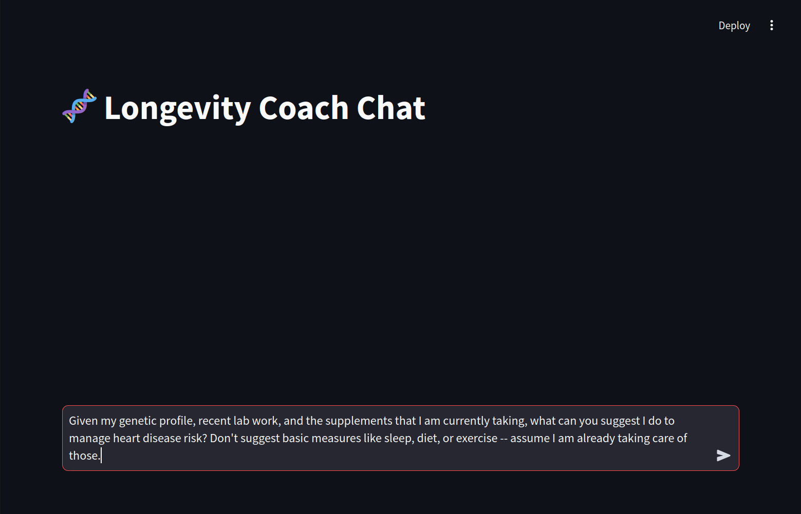

In this post, I want to share a project I recently released on GitHub: a [RAG-Powered LLM Longevity Coach](https://github.com/tylerburleigh/LLM-RAG-Longevity-Coach).

This application implements a Retrieval-Augmented Generation (RAG) chatbot that offers personalized health and longevity advice — ideal for anyone (like myself) who is both curious about health and longevity, and also curious about how LLMs can tap into large datasets in a more targeted and efficient way.

The chatbot leverages both a large language model (LLM) and a vector-based retrieval system (i.e., FAISS) to ensure that only the most relevant user data is used to generate responses. This post will walk you through the motivation, the workflow, and practical considerations for building a RAG-powered health app.

I built this in a weekend, collaborating with an AI coding assistant (currently I am using [Cursor AI](https://cursor.com) with a Claude 3.5 Sonnet model). However it has taken longer than that to collect my own health information for the vector store. I have been using this app (and a more nascent version of it) for a few weeks now, and it seems to provide useful insights that can be the starting points for actionable steps to improve longevity. Of course, the usual disclaimer applies: I am not a doctor, and the advice provided by the LLM is not intended to be a substitute for professional medical advice.

## Motivation and context

Health-related information can become extensive. Simply dumping all of your medical details into a prompt often leads to bloated responses, token overuse, and confusion in the generated content.

By contrast, a RAG approach narrows the scope to only the pieces of information that matter to any given query. This can both reduce cost and improve the relevance of LLM responses.

## Project overview

### Streamlit frontend

The user interacts with the Longevity Coach via a simple [Streamlit](https://streamlit.io/) app. The conversation is displayed in real time, with an optional "explanation" or "thought process" view to understand how the system arrives at a given retrieval strategy.

### Vector search integration

When a user types a query, the application constructs a search strategy and queries a FAISS-backed vector store for relevant data. This store can hold large amounts of health data -- ranging from gene variants to complex lab results -- and only the documents that match the query context are retrieved.

FAISS (Facebook AI Similarity Search) is a library developed by Meta (formerly Facebook) that enables the efficient searching of vector embeddings. In a Retrieval-Augmented Generation (RAG) pipeline, FAISS allows you to store and quickly retrieve documents or data chunks based on their vectorized similarity to a given query.

### Cost and accuracy considerations

By focusing on relevant data, you avoid a giant prompt stuffed with irrelevant details. This directly reduces token usage (and associated costs) while also boosting accuracy. There's less "noise" to distract the model.

## How it works

1. **User Interaction via Streamlit**
   All queries start with a simple text box in the Streamlit interface. For instance, a query might be:
   "What supplements should I consider for longevity based on my genetics and lab results?"

2. **Developing a Search Strategy**
   The system analyzes the user's question (e.g., "heart disease risk") and filters the search space to only match relevant genetic markers, lab results, or supplement details. This helps the chatbot focus on the user's specific needs rather than drowning in the entire dataset.

3. **Retrieving Relevant Information**
   A vector-based search kicks in, using FAISS to efficiently look up documents from a large repository of user health data. Only the top-matching documents are returned.

4. **Generating the Response**
   The final query plus the retrieved snippets are passed into the LLM. Since the model only sees relevant info, it produces a more relevant answer.

## Screenshots

Here are a few snapshots of what the interface looks like:

- **User enters a query**
  

- **Chatbot thinking**
  

- **RAG search strategy**
  

- **Final response**
  

## Getting started

If you want to try the app, you can get the code at the [GitHub repository](https://github.com/tylerburleigh/LLM-RAG-Longevity-Coach). The repo includes instructions for how to set up the environment and run the app.

## Why RAG?

1. **Efficient Resource Use**
   Avoid flooding the model with data. RAG narrows the prompt to only what's necessary.

2. **Relevance and Accuracy**
   A targeted context feed yields answers that are more on-point and less prone to hallucination.

3. **Scales with Large Datasets**
   As more data is added—like new lab results or updated genetic findings—the retrieval pipeline still only picks the relevant bits.

## Conclusion

Building an LLM-based chatbot in the health and longevity domain presents unique challenges: large, variable datasets and a high need for personalized yet accurate responses. Using a RAG approach strikes the right balance between efficiency and user-specific context. By gathering only the "must-know" details from a vector store, we reduce token usage, and produce more reliable insights.

