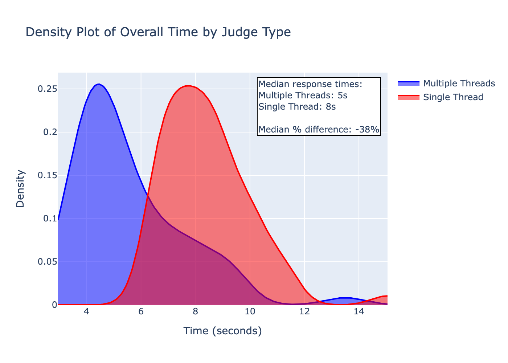

# Introduction

Response latency is an important factor when engineering many LLM applications. There are many ways to reduce latency, such as by reducing task complexity through simpler task requirements, setting `max_tokens` to a lower value, or using a smaller language model (e.g., `gpt-4o-mini` vs. `gpt-4o`). However, many of these approaches may sacrifice quality for speed. One approach to reducing latency that is unlikely to sacrifice quality (and in many cases may even improve it) is breaking the task down into sub-tasks that can be run in parallel.

In this post, I run an experiment using the MT Bench dataset to demonstrate the latency benefits of a multi-threaded LLM Judge. I engineer the same judge using two architectural approaches:

1. **Single-threaded (Combined) Approach**: Evaluate all quality dimensions in a single LLM call
2. **Multi-threaded (Parallel) Approach**: Evaluate each quality dimension in parallel using separate asynchronous LLM calls

Using the LLM Judge, I evaluate answers to questions in the MT Bench dataset across six dimensions:

- **Helpfulness**: How useful the answer is in addressing the user's needs
- **Relevance**: How well the answer addresses the specific question asked
- **Accuracy**: Whether the information provided is factually correct
- **Depth**: How thoroughly the answer explores the topic
- **Creativity**: The originality and innovative approach in presenting the answer
- **Level of Detail**: The granularity and specificity of information provided

Each dimension is scored on a scale of 1-10 with a rubric for what scores mean.

# Orthogonality

When designing an LLM Judge that evaluates multiple dimensions of quality, "orthogonality" provides a useful heuristic for determining when a multi-threaded approach might be appropriate. In this context, orthogonality refers to the degree to which different evaluation dimensions can be assessed independently without requiring knowledge of the assessments made in other dimensions.

Theoretically, two evaluation dimensions can be considered orthogonal if:

- They measure conceptually distinct aspects of quality
- Evaluating one dimension doesn't significantly benefit from knowledge of the evaluation of other dimensions
- The dimensions can be assessed independently without compromising the quality of the assessment

The degree of orthogonality can also be quantified: If changes in the scores on one dimension have no correlation with changes in scores on the other dimension, then the dimensions are orthogonal. In practice, most evaluation dimensions in natural language tasks aren't perfectly orthogonal, but the degree of orthogonality can help determine their suitability for parallel evaluation.

This statistical definition is precisely what makes orthogonality such a useful heuristic for determining parallelization potential -- dimensions with low correlation coefficients can be evaluated independently without losing meaningful information that would be gained from evaluating them together.

The six dimensions in our experiment -- Helpfulness, Relevance, Accuracy, Depth, Creativity, and Level of Detail -- are largely orthogonal. For example, an answer can be highly accurate (factually correct) while lacking depth (not exploring the topic thoroughly). Similarly, an answer can be highly creative while being less helpful for the user's specific needs. Therefore, a multi-threaded approach that evaluates each dimension in parallel does seem appropriate.

# Additional benefits

In addition to improving the latency of LLM Judge evaluations, by breaking the task down into smaller tasks, it's also possible that the following benefits would be realized:

- **Higher quality / accuracy**: By breaking the task down into smaller tasks that can be evaluated in parallel, it's possible that the quality / accuracy of the LLM Judge evaluations would be improved, due to the singular focus of each task.
- **Smaller language models**: By breaking the task down into smaller tasks, it's possible that smaller language models could be used without sacrificing quality.

# Code Structure

The code for this experiment is organized into several Python modules:

```
llm_judge/
├── config.py
├── experiment.py
├── judge.py
├── LLMClient.py
├── main.py
├── models.py
└── results.py
```

Let's consider these code modules one by one:

## Configuration

The `Configuration` module (`config.py`) defines parameters for our experiment:

```python
from dataclasses import dataclass
from pathlib import Path

# Get the project root directory (parent of llm_judge directory)
PROJECT_ROOT = Path(__file__).parent.parent.absolute()

@dataclass
class ExperimentConfig:
    SAMPLE_SIZE: int = 32
    RANDOM_SEED: int = 42
    MAX_TOKENS: int = 256
    NUM_RUNS: int = 1
    RESULTS_JSONL: Path = PROJECT_ROOT / 'experiment_results.jsonl'
    RESULTS_TXT: Path = PROJECT_ROOT / 'experiment_results.txt'

@dataclass
class FileConfig:
    DATASET_PATH: Path = PROJECT_ROOT / 'data/pairwise_evaluator_dataset.json'
    RESULTS_JSONL: Path = PROJECT_ROOT / 'experiment_results.jsonl'
    RESULTS_TXT: Path = PROJECT_ROOT / 'experiment_results.txt' 
```

## The LLM Judge

The core module is the `LLMJudge` class (`judge.py`), which implements the single-threaded and multi-threaded approaches, and includes the prompts for the LLM.

<details><summary>Click to view the LLM Judge code</summary>

```python
import asyncio
import time
from typing import List, Tuple
import re
import json
from pathlib import Path

from .models import (
    QAPair, DetailedJudgmentScores, DimensionAnalysis, 
    QAPairTiming, QAPairTokens, ExperimentRun
)
from .LLMClient import LLMClient
from .config import ExperimentConfig
from .results import ResultWriter

class LLMJudge:
    def __init__(self):
        self.client = LLMClient()
        self.config = ExperimentConfig()
        self.result_writer = ResultWriter()

    def _parse_scores(self, response: str) -> DetailedJudgmentScores:
        """Parse the LLM response into scores and thinking steps using XML format"""
        def extract_dimension_analysis(dimension: str) -> DimensionAnalysis:
            thinking_pattern = f"<{dimension}>.*?<StepByStepThinking>(.*?)</StepByStepThinking>"
            score_pattern = f"<{dimension}>.*?<Score>(\d+)</Score>.*?</{dimension}>"
            
            thinking_match = re.search(thinking_pattern, response, re.DOTALL)
            score_match = re.search(score_pattern, response, re.DOTALL)
            
            thinking = thinking_match.group(1).strip() if thinking_match else "No analysis provided"
            score = int(score_match.group(1)) if score_match else 0
            
            return DimensionAnalysis(thinking=thinking, score=score)
        
        return DetailedJudgmentScores(
            helpfulness=extract_dimension_analysis("Helpfulness"),
            relevance=extract_dimension_analysis("Relevance"),
            accuracy=extract_dimension_analysis("Accuracy"),
            depth=extract_dimension_analysis("Depth"),
            creativity=extract_dimension_analysis("Creativity"),
            level_of_detail=extract_dimension_analysis("Level_of_Detail")
        )

    def _has_existing_result(self, qa_pair: QAPair, judge_type: str) -> bool:
        """Check if this QA pair has already been evaluated by this judge type"""
        results_file = Path(self.config.RESULTS_JSONL)
        if not results_file.exists():
            return False
        
        try:
            with results_file.open('r', encoding='utf-8') as f:  # Use Path.open() instead of open()
                for line in f:
                    if not line.strip():  # Skip empty lines
                        continue
                    try:
                        result = json.loads(line)
                        if (result['judge_type'] == judge_type and 
                            result['question'] == qa_pair.question and
                            result['answer'] == qa_pair.answer and 
                            result['model'] == qa_pair.model_name):
                            print(f"Found existing result for {qa_pair.model_name} - {qa_pair.question[:50]}...")
                            return True
                    except json.JSONDecodeError:
                        continue  # Skip invalid JSON lines
        except (FileNotFoundError, KeyError):
            return False
        
        return False

    async def judge_combined(self, qa_pairs: List[QAPair]) -> Tuple[List[DetailedJudgmentScores], float, List[QAPairTiming]]:
        """Judge each QA pair independently with all dimensions at once"""
        start_time = time.time()
        all_scores = []
        pair_timings = []

        # Define scoring guidelines
        scoring_guidelines = """
        Scoring Guidelines:
        1-2: Poor - Major issues or completely misses the mark
        3-4: Below Average - Significant room for improvement
        5-6: Average - Meets basic expectations
        7-8: Good - Strong performance with minor issues
        9-10: Excellent - Nearly perfect or perfect performance
        """

        dimension_definitions = {
            'Helpfulness': 'How useful and beneficial the answer is in addressing the user\'s needs. A helpful answer provides practical, actionable information that serves the user\'s purpose.',
            'Relevance': 'How well the answer addresses the specific question asked. A relevant answer stays on topic and provides information that directly answers the question.',
            'Accuracy': 'Whether the information provided is factually correct. Check for any errors, misleading statements, or questionable claims.',
            'Depth': 'How thoroughly the answer explores the topic, including underlying concepts and relationships. A deep answer goes beyond surface-level explanations.',
            'Creativity': 'The originality and innovative approach in presenting the answer. Consider unique perspectives, examples, or explanations used.',
            'Level_of_Detail': 'The granularity and specificity of information provided. A detailed answer includes specific examples, explanations, and supporting information.'
        }

        for i, qa_pair in enumerate(qa_pairs, 1):
            # Skip if already evaluated
            if self._has_existing_result(qa_pair, "combined"):
                print(f"\nSkipping QA pair {i}/{len(qa_pairs)} (combined approach) - already evaluated")
                continue
                
            pair_start_time = time.time()
            print(f"\nProcessing QA pair {i}/{len(qa_pairs)} (combined approach)")
            print(f"Question: {qa_pair.question[:50]}...")

            system_message = f"""You are an expert judge evaluating question-answer pairs.
            For each dimension, think step by step about your evaluation before giving a score (1-10).
            
            {scoring_guidelines}
            
            Evaluation dimensions:
            - Helpfulness: {dimension_definitions['Helpfulness']}
            - Relevance: {dimension_definitions['Relevance']}
            - Accuracy: {dimension_definitions['Accuracy']}
            - Depth: {dimension_definitions['Depth']}
            - Creativity: {dimension_definitions['Creativity']}
            - Level of Detail: {dimension_definitions['Level_of_Detail']}
            
            Question: ```{qa_pair.question}```
            Answer: ```{qa_pair.answer}```
            
            For each dimension, follow these steps in your evaluation:
            1. First, carefully analyze the question and answer
            2. Consider specific strengths and weaknesses related to the dimension
            3. Provide concrete examples from the answer to support your analysis
            4. Assign a score based on the scoring guidelines
            
            Provide your analysis and scores in this XML format:

            <Helpfulness>
            <StepByStepThinking>[your detailed analysis for helpfulness]</StepByStepThinking>
            <Score>[score from 1-10]</Score>
            </Helpfulness>

            <Relevance>
            <StepByStepThinking>[your detailed analysis for relevance]</StepByStepThinking>
            <Score>[score from 1-10]</Score>
            </Relevance>

            <Accuracy>
            <StepByStepThinking>[your detailed analysis for accuracy]</StepByStepThinking>
            <Score>[score from 1-10]</Score>
            </Accuracy>

            <Depth>
            <StepByStepThinking>[your detailed analysis for depth]</StepByStepThinking>
            <Score>[score from 1-10]</Score>
            </Depth>

            <Creativity>
            <StepByStepThinking>[your detailed analysis for creativity]</StepByStepThinking>
            <Score>[score from 1-10]</Score>
            </Creativity>

            <Level_of_Detail>
            <StepByStepThinking>[your detailed analysis for level of detail]</StepByStepThinking>
            <Score>[score from 1-10]</Score>
            </Level_of_Detail>"""

            print("Sending prompt to LLM for all dimensions...")
            result = await self.client.get_completion(
                system_message=system_message,
                prompt="",
                max_tokens=self.config.MAX_TOKENS*6
            )
            print("Received response from LLM")

            scores = self._parse_scores(result.content)
            all_scores.append(scores)

            timing = QAPairTiming(
                qa_index=i,
                question=qa_pair.question,
                total_time=time.time() - pair_start_time,
                tokens=QAPairTokens(
                    input_tokens=result.input_tokens,
                    output_tokens=result.output_tokens,
                    total_tokens=result.input_tokens + result.output_tokens
                )
            )
            pair_timings.append(timing)

            # Write result immediately after each QA pair
            current_time = time.time() - start_time
            self.result_writer.write_run_results(
                [qa_pair],  # Single QA pair
                ExperimentRun(
                    combined_time=current_time,
                    parallel_time=current_time,  # Use same time instead of 0
                    combined_pair_times=[timing],
                    parallel_pair_times=[]
                ),
                [scores],  # Single score
                []  # No parallel scores
            )

            print(f"Parsed scores for all dimensions (took {timing.total_time:.2f}s)")
            print(f"Token usage: {result.input_tokens} in, {result.output_tokens} out")

        elapsed_time = time.time() - start_time
        print(f"\nCompleted all evaluations in {elapsed_time:.2f} seconds")
        return all_scores, elapsed_time, pair_timings

    async def judge_dimension(self, qa_pair: QAPair, dimension: str, scoring_guidelines: str = "") -> Tuple[DimensionAnalysis, float, Tuple[int, int]]:
        dim_start_time = time.time()
        
        dimension_definitions = {
            'Helpfulness': 'How useful and beneficial the answer is in addressing the user\'s needs. A helpful answer provides practical, actionable information that serves the user\'s purpose.',
            'Relevance': 'How well the answer addresses the specific question asked. A relevant answer stays on topic and provides information that directly answers the question.',
            'Accuracy': 'Whether the information provided is factually correct. Check for any errors, misleading statements, or questionable claims.',
            'Depth': 'How thoroughly the answer explores the topic, including underlying concepts and relationships. A deep answer goes beyond surface-level explanations.',
            'Creativity': 'The originality and innovative approach in presenting the answer. Consider unique perspectives, examples, or explanations used.',
            'Level_of_Detail': 'The granularity and specificity of information provided. A detailed answer includes specific examples, explanations, and supporting information.'
        }

        system_message = f"""You are an expert judge evaluating a specific dimension of a question-answer pair.
        Think step by step about your evaluation before giving a score (1-10).
        
        You are evaluating the {dimension.lower()} dimension:
        {dimension_definitions[dimension]}
        
        {scoring_guidelines}

        Question: ```{qa_pair.question}```
        Answer: ```{qa_pair.answer}```
        
        Follow these steps in your evaluation:
        1. First, carefully analyze the question and answer
        2. Consider specific strengths and weaknesses related to {dimension.lower()}
        3. Provide concrete examples from the answer to support your analysis
        4. Assign a score based on the scoring guidelines
        
        Provide your analysis and score in this XML format:

        <{dimension}>
        <StepByStepThinking>[your detailed analysis for {dimension.lower()}]</StepByStepThinking>
        <Score>[score from 1-10]</Score>
        </{dimension}>"""

        result = await self.client.get_completion(
            system_message=system_message,
            prompt="",
            max_tokens=self.config.MAX_TOKENS
        )

        analysis = self._parse_scores(result.content).__getattribute__(dimension.lower())
        return analysis, time.time() - dim_start_time, (result.input_tokens, result.output_tokens)

    async def judge_parallel(self, qa_pairs: List[QAPair]) -> Tuple[List[DetailedJudgmentScores], float, List[QAPairTiming]]:
        """Judge dimensions in parallel for each QA pair"""
        start_time = time.time()
        all_scores = []
        pair_timings = []

        # Add scoring guidelines
        scoring_guidelines = """
        Scoring Guidelines:
        1-2: Poor - Major issues or completely misses the mark
        3-4: Below Average - Significant room for improvement
        5-6: Average - Meets basic expectations
        7-8: Good - Strong performance with minor issues
        9-10: Excellent - Nearly perfect or perfect performance
        """

        for i, qa_pair in enumerate(qa_pairs, 1):
            # Skip if already evaluated
            if self._has_existing_result(qa_pair, "parallel"):
                print(f"\nSkipping QA pair {i}/{len(qa_pairs)} (parallel approach) - already evaluated")
                continue
                
            pair_start_time = time.time()
            print(f"\nProcessing QA pair {i}/{len(qa_pairs)} (parallel approach)")
            print(f"Question: {qa_pair.question[:50]}...")

            dimensions = ['Helpfulness', 'Relevance', 'Accuracy', 'Depth', 'Creativity', 'Level_of_Detail']
            tasks = [self.judge_dimension(qa_pair, dim, scoring_guidelines) for dim in dimensions]
            results = await asyncio.gather(*tasks)

            analyses, times, tokens = zip(*results)
            dimension_times = dict(zip(dimensions, times))
            dimension_tokens = dict(zip(dimensions, tokens))

            scores = DetailedJudgmentScores(
                helpfulness=analyses[0],
                relevance=analyses[1],
                accuracy=analyses[2],
                depth=analyses[3],
                creativity=analyses[4],
                level_of_detail=analyses[5]
            )
            all_scores.append(scores)

            total_time = time.time() - pair_start_time
            timing = QAPairTiming(
                qa_index=i,
                question=qa_pair.question,
                total_time=total_time,
                tokens=QAPairTokens(
                    input_tokens=sum(t[0] for t in tokens),
                    output_tokens=sum(t[1] for t in tokens),
                    total_tokens=sum(sum(t) for t in tokens),
                    dimension_tokens=dimension_tokens
                ),
                dimension_times=dimension_times
            )
            pair_timings.append(timing)

            # Write result immediately after each QA pair
            current_time = time.time() - start_time
            self.result_writer.write_run_results(
                [qa_pair],  # Single QA pair
                ExperimentRun(
                    combined_time=current_time,  # Use same time instead of 0
                    parallel_time=current_time,
                    combined_pair_times=[],
                    parallel_pair_times=[timing]
                ),
                [],  # No combined scores
                [scores]  # Single parallel score
            )

            print(f"Completed parallel evaluation in {total_time:.2f}s")
            for dim, t in dimension_times.items():
                in_tokens, out_tokens = dimension_tokens[dim]
                print(f"  {dim}: {t:.2f}s, {in_tokens} in, {out_tokens} out")

        elapsed_time = time.time() - start_time
        print(f"\nCompleted all evaluations in {elapsed_time:.2f} seconds")
        return all_scores, elapsed_time, pair_timings 
```

</details>

## The Experiment Runner

The `Experiment Runner` (`experiment.py`) coordinates the evaluation process:

<details><summary>Click to view the Experiment Runner code</summary>

```python
from typing import List, Optional, Tuple
import random
import asyncio
from statistics import mean, stdev

from .models import QAPair, DetailedJudgmentScores, ExperimentRun
from .judge import LLMJudge
from .results import ResultWriter
from .config import FileConfig

class ExperimentRunner:
    def __init__(self, sample_size: int = 16, seed: int = 42):
        self.sample_size = sample_size
        random.seed(seed)
        self.judge = LLMJudge()
        self.result_writer = ResultWriter()
        self.config = FileConfig()

    async def _load_pairwise_data(self) -> List[QAPair]:
        """Load QA pairs from the dataset file"""
        import json
        
        try:
            with open(self.config.DATASET_PATH, 'r') as f:
                data = json.load(f)
            
            qa_pairs = []
            
            # Extract both answers from each example
            for example in data['examples']:
                question = example['query']
                
                # First answer
                answer1 = example['answer']
                model1 = example['answer_by']['model_name'] or 'unknown'
                qa_pairs.append(QAPair(
                    question=question, 
                    answer=answer1,
                    model_name=model1
                ))
                
                # Second answer
                answer2 = example['second_answer']
                model2 = example['second_answer_by']['model_name'] or 'unknown'
                qa_pairs.append(QAPair(
                    question=question, 
                    answer=answer2,
                    model_name=model2
                ))
            
            return qa_pairs
        
        except (FileNotFoundError, json.JSONDecodeError) as e:
            print(f"Error loading pairwise evaluator dataset: {e}")
            return None

    def _sample_qa_pairs(self, qa_pairs: List[QAPair]) -> List[QAPair]:
        """Sample QA pairs from the dataset"""
        # Group QA pairs by unique question text
        unique_questions = {}
        for qa in qa_pairs:
            if qa.question not in unique_questions:
                unique_questions[qa.question] = []
            unique_questions[qa.question].append(qa)
        
        # Sample from unique questions
        sampled_questions = random.sample(list(unique_questions.keys()), self.sample_size)
        
        # For each sampled question, take just the first two QA pairs
        sampled_pairs = []
        for question in sampled_questions:
            sampled_pairs.extend(unique_questions[question][:2])
        
        return sampled_pairs

    async def _run_single_experiment(
        self, 
        qa_pairs: List[QAPair], 
        run_number: int
    ) -> Tuple[ExperimentRun, List[DetailedJudgmentScores], List[DetailedJudgmentScores]]:
        """Run a single experiment with both combined and parallel approaches"""
        combined_scores, combined_time, combined_timings = await self.judge.judge_combined(qa_pairs)
        parallel_scores, parallel_time, parallel_timings = await self.judge.judge_parallel(qa_pairs)
        
        run = ExperimentRun(
            combined_time=combined_time,
            parallel_time=parallel_time,
            combined_pair_times=combined_timings,
            parallel_pair_times=parallel_timings
        )
        
        return run, combined_scores, parallel_scores

    def _print_detailed_timing(self, run: ExperimentRun):
        """Print detailed timing information for a run"""
        print("\nDetailed Timing and Token Analysis:")
        
        print("\nCombined Approach QA Pair Times:")
        for timing in run.combined_pair_times:
            print(f"  QA Pair {timing.qa_index}: {timing.total_time:.2f}s")
            print(f"    Tokens: {timing.tokens.input_tokens} in, {timing.tokens.output_tokens} out")
            
        print("\nParallel Approach QA Pair Times:")
        for timing in run.parallel_pair_times:
            print(f"  QA Pair {timing.qa_index}: {timing.total_time:.2f}s")
            if timing.dimension_times:
                for dim, time in timing.dimension_times.items():
                    tokens_in, tokens_out = timing.tokens.dimension_tokens[dim]
                    print(f"    {dim}: {time:.2f}s, {tokens_in} in, {tokens_out} out")

    async def load_qa_pairs(self) -> List[QAPair]:
        """Load and sample QA pairs from dataset"""
        try:
            qa_pairs = await self._load_pairwise_data()
            if not qa_pairs:
                return self._get_fallback_pairs()
            
            return self._sample_qa_pairs(qa_pairs)
        except Exception as e:
            print(f"Error loading QA pairs: {e}")
            return self._get_fallback_pairs()

    async def run_experiment(self, qa_pairs: List[QAPair], num_runs: int = 1) -> List[ExperimentRun]:
        """Run the experiment with specified number of runs"""
        runs = []
        combined_scores = None
        parallel_scores = None

        for i in range(num_runs):
            run, combined_scores, parallel_scores = await self._run_single_experiment(qa_pairs, i + 1)
            runs.append(run)
            
            # Write results after each run
            self.result_writer.write_run_results(
                qa_pairs, run, combined_scores, parallel_scores
            )

        return runs

    @staticmethod
    def _get_fallback_pairs() -> List[QAPair]:
        """Return fallback QA pairs if dataset loading fails"""
        return [
            QAPair(
                question="What is Python?",
                answer="Python is a high-level programming language known for its simplicity and readability.",
                model_name="fallback"
            ),
            QAPair(
                question="How does a for loop work?",
                answer="A for loop iterates over a sequence of elements, executing code for each element.",
                model_name="fallback"
            ),
        ] 
```

</details>

And we can run the experiment with the following code in the `Main` module (`main.py`)

<details><summary>Click to view the Main module code</summary>

```python
from llm_judge.experiment import ExperimentRunner
from llm_judge.config import ExperimentConfig

async def run():
    config = ExperimentConfig()
    runner = ExperimentRunner(
        sample_size=config.SAMPLE_SIZE,
        seed=config.RANDOM_SEED
    )
    
    qa_pairs = await runner.load_qa_pairs()
    await runner.run_experiment(qa_pairs, config.NUM_RUNS)

# Run it
await run()
```

</details>

## Other modules

The `Result Writer` module (`results.py`) is responsible for writing the results to a JSONL file.

<details><summary>Click to view the Result Writer code</summary>

```python

from typing import List
import json
from statistics import mean, stdev
from pathlib import Path

from .models import (
    QAPair, 
    DetailedJudgmentScores, 
    ExperimentRun,
    QAPairTiming
)
from .config import FileConfig

class ResultWriter:
    def __init__(self, config: FileConfig = None):
        self.config = config or FileConfig()
        
        # Ensure the results directories exist
        jsonl_path = Path(self.config.RESULTS_JSONL)
        txt_path = Path(self.config.RESULTS_TXT)
        
        # Create parent directories if they don't exist
        jsonl_path.parent.mkdir(parents=True, exist_ok=True)
        txt_path.parent.mkdir(parents=True, exist_ok=True)
        
        # Create files if they don't exist (but don't clear them)
        if not jsonl_path.exists():
            jsonl_path.touch()
        if not txt_path.exists():
            txt_path.touch()

    def write_run_results(
        self,
        qa_pairs: List[QAPair],
        run: ExperimentRun,
        combined_scores: List[DetailedJudgmentScores],
        parallel_scores: List[DetailedJudgmentScores]
    ) -> None:
        """Write results for a single experiment run to bJSONL file"""
        self._write_to_jsonl(qa_pairs, run, combined_scores, parallel_scores)

    def _write_to_jsonl(
        self,
        qa_pairs: List[QAPair],
        run: ExperimentRun,
        combined_scores: List[DetailedJudgmentScores],
        parallel_scores: List[DetailedJudgmentScores]
    ) -> None:
        """Write results to JSONL file"""
        def format_dimension_data(dimension_name: str, scores: DetailedJudgmentScores, timing: QAPairTiming, is_parallel: bool):
            dimension_data = {
                "thinking": getattr(scores, dimension_name.lower()).thinking,
                "score": getattr(scores, dimension_name.lower()).score,
            }
            
            if is_parallel and timing.dimension_times:
                dimension_data.update({
                    "input_tokens": timing.tokens.dimension_tokens[dimension_name][0],
                    "output_tokens": timing.tokens.dimension_tokens[dimension_name][1],
                    "time_ms": int(timing.dimension_times[dimension_name] * 1000)
                })
            else:
                dimension_data.update({
                    "input_tokens": None,
                    "output_tokens": None,
                    "time_ms": None
                })
                
            return dimension_data

        def create_result_entry(qa_pair: QAPair, scores: DetailedJudgmentScores, timing: QAPairTiming, is_parallel: bool):
            dimensions = ['Helpfulness', 'Relevance', 'Accuracy', 'Depth', 'Creativity', 'Level_of_Detail']
            
            entry = {
                "judge_type": "parallel" if is_parallel else "combined",
                "question": qa_pair.question,
                "answer": qa_pair.answer,
                "model": qa_pair.model_name
            }
            
            for dim in dimensions:
                entry[dim.lower()] = format_dimension_data(dim, scores, timing, is_parallel)
            
            entry.update({
                "sum_input_tokens": timing.tokens.input_tokens,
                "sum_output_tokens": timing.tokens.output_tokens,
                "overall_time_ms": int(timing.total_time * 1000)
            })
            
            return entry

        with Path(self.config.RESULTS_JSONL).open('a', encoding='utf-8') as f:
            # Write combined approach results
            for i, (qa_pair, scores, timing) in enumerate(zip(qa_pairs, combined_scores, run.combined_pair_times)):
                entry = create_result_entry(qa_pair, scores, timing, is_parallel=False)
                f.write(json.dumps(entry, ensure_ascii=False) + '\n')
            
            # Write parallel approach results
            for i, (qa_pair, scores, timing) in enumerate(zip(qa_pairs, parallel_scores, run.parallel_pair_times)):
                entry = create_result_entry(qa_pair, scores, timing, is_parallel=True)
                f.write(json.dumps(entry, ensure_ascii=False) + '\n')

```

</details>

And the `Models` module (`models.py`) defines the data structures.

<details><summary>Click to view the Models code</summary>

```python
from dataclasses import dataclass
from typing import Dict, List, Tuple, Optional

@dataclass
class QAPair:
    question: str
    answer: str
    model_name: str

@dataclass
class DimensionAnalysis:
    thinking: str
    score: int

@dataclass
class DetailedJudgmentScores:
    helpfulness: DimensionAnalysis
    relevance: DimensionAnalysis
    accuracy: DimensionAnalysis
    depth: DimensionAnalysis
    creativity: DimensionAnalysis
    level_of_detail: DimensionAnalysis
    
    def __str__(self) -> str:
        result = []
        for dimension in ['helpfulness', 'relevance', 'accuracy', 'depth', 'creativity', 'level_of_detail']:
            analysis = getattr(self, dimension)
            result.extend([
                f"\n{dimension.title()}:",
                f"Thinking: {analysis.thinking}",
                f"Score: {analysis.score}/10",
                ""
            ])
        return "\n".join(result)

@dataclass
class QAPairTokens:
    input_tokens: int
    output_tokens: int
    total_tokens: int
    dimension_tokens: Optional[Dict[str, Tuple[int, int]]] = None

@dataclass
class QAPairTiming:
    qa_index: int
    question: str
    total_time: float
    tokens: QAPairTokens
    dimension_times: Optional[Dict[str, float]] = None

@dataclass
class ExperimentRun:
    combined_time: float
    parallel_time: float
    combined_pair_times: List[QAPairTiming]
    parallel_pair_times: List[QAPairTiming]
    
    @property
    def time_difference(self) -> float:
        """B - A: Positive means parallel was slower"""
        return self.parallel_time - self.combined_time
    
    @property
    def percent_difference(self) -> float:
        """((B - A) / A) * 100: Positive means parallel was slower"""
        if self.combined_time == 0:
            return float('inf') if self.parallel_time > 0 else 0.0
        return (self.time_difference / self.combined_time) * 100

    @property
    def combined_tokens(self) -> Tuple[int, int, int]:
        """Returns (input_tokens, output_tokens, total_tokens) for combined approach"""
        input_tokens = sum(pt.tokens.input_tokens for pt in self.combined_pair_times)
        output_tokens = sum(pt.tokens.output_tokens for pt in self.combined_pair_times)
        return input_tokens, output_tokens, input_tokens + output_tokens

    @property
    def parallel_tokens(self) -> Tuple[int, int, int]:
        """Returns (input_tokens, output_tokens, total_tokens) for parallel approach"""
        input_tokens = sum(pt.tokens.input_tokens for pt in self.parallel_pair_times)
        output_tokens = sum(pt.tokens.output_tokens for pt in self.parallel_pair_times)
        return input_tokens, output_tokens, input_tokens + output_tokens 
```

</details>

## Analysis

### Latency

After running the experiment, we can analyze the latency distributions to determine if the multi-threaded approach was faster:

```python
import json
import pandas as pd
from scipy import stats
import plotly.graph_objects as go
import numpy as np

data = []
with open('experiment_results.jsonl', 'r') as file:
    for line in file:
        data.append(json.loads(line))

# Separate data by judge type and convert to seconds
parallel_times = [entry['overall_time_ms']/1000 for entry in data if entry['judge_type'] == 'parallel']
combined_times = [entry['overall_time_ms']/1000 for entry in data if entry['judge_type'] == 'combined']

# Calculate medians
median_parallel = sorted(parallel_times)[len(parallel_times)//2]
median_combined = sorted(combined_times)[len(combined_times)//2]

# Calculate pairwise percentage differences
pct_diffs = []
for entry_parallel in data:
    if entry_parallel['judge_type'] == 'parallel':
        for entry_combined in data:
            if (entry_combined['judge_type'] == 'combined' and 
                entry_parallel['question'] == entry_combined['question'] and 
                entry_parallel.get('model') == entry_combined.get('model')):
                pct_diff = ((entry_parallel['overall_time_ms'] - entry_combined['overall_time_ms']) / 
                          entry_combined['overall_time_ms'] * 100)
                pct_diffs.append(pct_diff)

median_pct_diff = sorted(pct_diffs)[len(pct_diffs)//2]

# Create kernel density estimation
kernel_parallel = stats.gaussian_kde(parallel_times)
kernel_combined = stats.gaussian_kde(combined_times)

# Create x range for smooth plotting
x_range = np.linspace(min(min(parallel_times), min(combined_times)),
                      max(max(parallel_times), max(combined_times)),
                      200)

# Create figure
fig = go.Figure()

# Add density plots
fig.add_trace(go.Scatter(x=x_range, 
                        y=kernel_parallel(x_range),
                        name='Multiple Threads',
                        fill='tozeroy',
                        line=dict(color='blue'),
                        opacity=0.6))

fig.add_trace(go.Scatter(x=x_range, 
                        y=kernel_combined(x_range),
                        name='Single Thread',
                        fill='tozeroy',
                        line=dict(color='red'),
                        opacity=0.6))

# Add statistics box
stats_text = (
    f"Median response times:<br>"
    f"Multiple Threads: {median_parallel:.0f}s<br>"
    f"Single Thread: {median_combined:.0f}s<br><br>"
    f"Median % difference: {median_pct_diff:.0f}%"
)

fig.add_annotation(
    x=0.98,  # Changed from 0.02 to 0.98 to move to right side
    y=0.98,
    xref="paper",
    yref="paper",
    text=stats_text,
    showarrow=False,
    font=dict(size=12),
    align="left",
    bgcolor="white",
    bordercolor="black",
    borderwidth=1,
    xanchor="right",  # Changed from 'left' to 'right'
    yanchor="top"
)

# Update layout
fig.update_layout(
    title='Density Plot of Overall Time by Judge Type',
    xaxis_title='Time (seconds)',
    yaxis_title='Density',
    showlegend=True,
    width=600,
    height=400
)

```



The density plot above shows the distribution of response times for both approaches. The multi-threaded approach was indeed faster -- it reduced latency by ~38% on average (median difference) compared to the single-threaded approach.

### Token Usage

```python
# Separate token data by judge type
parallel_input_tokens = [entry['sum_input_tokens'] for entry in data if entry['judge_type'] == 'parallel']
parallel_output_tokens = [entry['sum_output_tokens'] for entry in data if entry['judge_type'] == 'parallel']
combined_input_tokens = [entry['sum_input_tokens'] for entry in data if entry['judge_type'] == 'combined']
combined_output_tokens = [entry['sum_output_tokens'] for entry in data if entry['judge_type'] == 'combined']

# Calculate medians
median_parallel_input = sorted(parallel_input_tokens)[len(parallel_input_tokens)//2]
median_parallel_output = sorted(parallel_output_tokens)[len(parallel_output_tokens)//2]
median_combined_input = sorted(combined_input_tokens)[len(combined_input_tokens)//2]
median_combined_output = sorted(combined_output_tokens)[len(combined_output_tokens)//2]

# Calculate pairwise percentage differences
input_pct_diffs = []
output_pct_diffs = []
for entry_parallel in data:
    if entry_parallel['judge_type'] == 'parallel':
        for entry_combined in data:
            if (entry_combined['judge_type'] == 'combined' and 
                entry_parallel['question'] == entry_combined['question'] and 
                entry_parallel.get('model') == entry_combined.get('model')):
                # Input tokens difference
                input_pct_diff = ((entry_parallel['sum_input_tokens'] - entry_combined['sum_input_tokens']) / 
                                entry_combined['sum_input_tokens'] * 100)
                input_pct_diffs.append(input_pct_diff)
                
                # Output tokens difference
                output_pct_diff = ((entry_parallel['sum_output_tokens'] - entry_combined['sum_output_tokens']) / 
                                 entry_combined['sum_output_tokens'] * 100)
                output_pct_diffs.append(output_pct_diff)

median_input_pct_diff = sorted(input_pct_diffs)[len(input_pct_diffs)//2]
median_output_pct_diff = sorted(output_pct_diffs)[len(output_pct_diffs)//2]

# Print results
print("\nToken Usage Summary:")
print(f"Multiple Threads:")
print(f"  Median Input Tokens:  {median_parallel_input:,}")
print(f"  Median Output Tokens: {median_parallel_output:,}")
print(f"\nSingle Thread:")
print(f"  Median Input Tokens:  {median_combined_input:,}")
print(f"  Median Output Tokens: {median_combined_output:,}")

print(f"\nMedian Pairwise Differences:")
print(f"  Input Tokens:  {median_input_pct_diff:+.1f}%")
print(f"  Output Tokens: {median_output_pct_diff:+.1f}%")
```

```text

Token Usage Summary:
Multiple Threads:
  Median Input Tokens:  2,751
  Median Output Tokens: 1,270

Single Thread:
  Median Input Tokens:  807
  Median Output Tokens: 518

Median Pairwise Differences:
  Input Tokens:  +240.9%
  Output Tokens: +139.5%
```

As expected, token usage increased for the multi-threaded approach. This is due to many of the same input tokens being used for each thread, but also due to the additional output tokens generated by each thread. More output tokens may reflect the additional reasoning and analysis performed by the LLM for each dimension, which may result in higher quality evaluations -- but this was not evaluated here.

## Limitations

This analysis has some limitations that are worth noting. Namely, I didn't evaluate the quality / accuracy of the LLM Judge evaluations. I focused only on the latency and token usage of the LLM Judges. I expect that the quality would be equal (or possibly even better) when using the multi-threaded approach, but I didn't evaluate that here.

## Conclusion

This experiment demonstrated the significant performance benefits of a multi-threaded approach when implementing an LLM judge to evaluate text quality across multiple dimensions. By breaking down the evaluation task into six orthogonal dimensions and processing them in parallel, latency was reduced by ~38% compared to evaluating all dimensions in a single LLM call. At the same time, token usage increased, which may result in higher quality evaluations -- but this was not here.

<script src="https://giscus.app/client.js"
        data-repo="tylerburleigh/tylerburleigh.github.io"
        data-repo-id="R_kgDOKMo8ww"
        data-category="Blog comments"
        data-category-id="DIC_kwDOIg6EJc4CSz92"
        data-mapping="pathname"
        data-strict="0"
        data-reactions-enabled="1"
        data-emit-metadata="0"
        data-input-position="bottom"
        data-theme="light"
        data-lang="en"
        crossorigin="anonymous"
        async>
</script>
