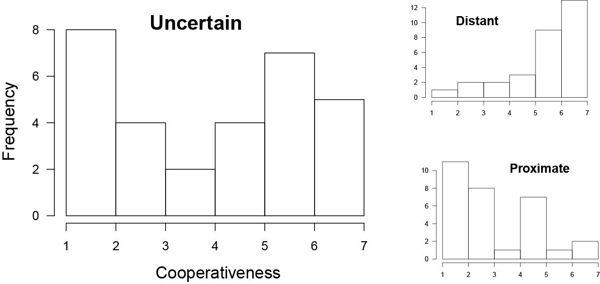

:::{articleinfo} burleigh-meegan-2017
:::

## Abstract

When students are faced with the decision of whether to assist a peer, they should be sensitive to the potential risks associated with doing so. Two factors associated with risky helping behaviour in the classroom are: (1) the grading practices that are used, and (2) knowledge of a peer's relative status. Normative ("curved") grading creates a situation in which peer-interactions are potentially competitive, but it is only those interactions with peers of a similar status that carry the potential for assistance to be costly to oneself. In two studies, we created hypothetical scenarios in which the grading practices (normative or absolute) and peer-status proximity (proximate, distant, or unknown) were manipulated, and asked participants to report their willingness to cooperate with a peer by sharing their notes from an important lecture. We found that when normative grading was used, individuals were less willing to assist a peer when they knew that the peer's status was proximate to their own. There was also less cooperation when peer status was unknown, under normative grading, which is consistent with a risk-aversion tendency.

## Important figure

