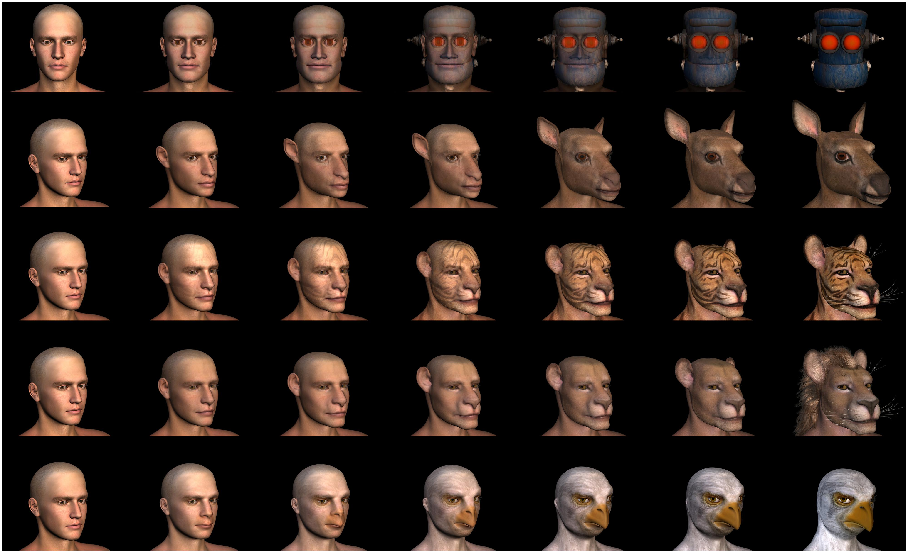

## Abstract

Stimuli that resemble humans, but are not perfectly human-like, are disliked compared to distinctly human and non-human stimuli. Accounts of this "Uncanny Valley" effect often focus on how changes in human resemblance can evoke different emotional responses. We present an alternate account based on the novel hypothesis that the Uncanny Valley is not directly related to 'human-likeness' per se, but instead reflects a more general form of stimulus devaluation that occurs when inhibition is triggered to resolve conflict between competing stimulus-related representations. We consider existing support for this inhibitory-devaluation hypothesis and further assess its feasibility through tests of two corresponding predictions that arise from the link between conflict-resolving inhibition and aversive response: (1) that the pronounced disliking of Uncanny-type stimuli will occur for any image that strongly activates multiple competing stimulus representations, even in the absence of any human-likeness, and (2) that the negative peak of an 'Uncanny Valley' should occur at the point of greatest stimulus-related conflict and not (in the presence of human-likeness) always closer to the 'human' end of a perceptual continuum. We measured affective responses to a set of line drawings representing non-human animal-animal morphs, in which each continuum midpoint was a bistable image (Experiment 1), as well as to sets of human-robot and human-animal computer-generated morphs (Experiment 2). Affective trends depicting classic Uncanny Valley functions occurred for all continua, including the non-human stimuli. Images at continua midpoints elicited significantly more negative affect than images at endpoints, even when the continua included a human endpoint. This illustrates the feasibility of the inhibitory-devaluation hypothesis and the need for further research into the possibility that the strong dislike of Uncanny-type stimuli reflects the negative affective consequences of cognitive inhibition.

## Important figure

