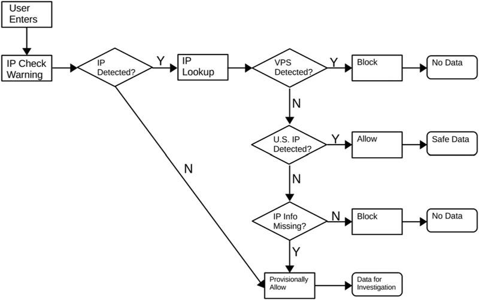

:::{articleinfo} kennedy-et-al-2020
:::

## Abstract

Amazon's Mechanical Turk is widely used for data collection; however, data quality may be declining due to the use of virtual private servers to fraudulently gain access to studies. Unfortunately, we know little about the scale and consequence of this fraud, and tools for social scientists to detect and prevent this fraud are underdeveloped. We first analyze 38 studies and show that this fraud is not new, but has increased recently. We then show that these fraudulent respondents provide particularly low-quality data and can weaken treatment effects. Finally, we provide two solutions: an easy-to-use application for identifying fraud in the existing datasets and a method for blocking fraudulent respondents in Qualtrics surveys.

## Important figure

