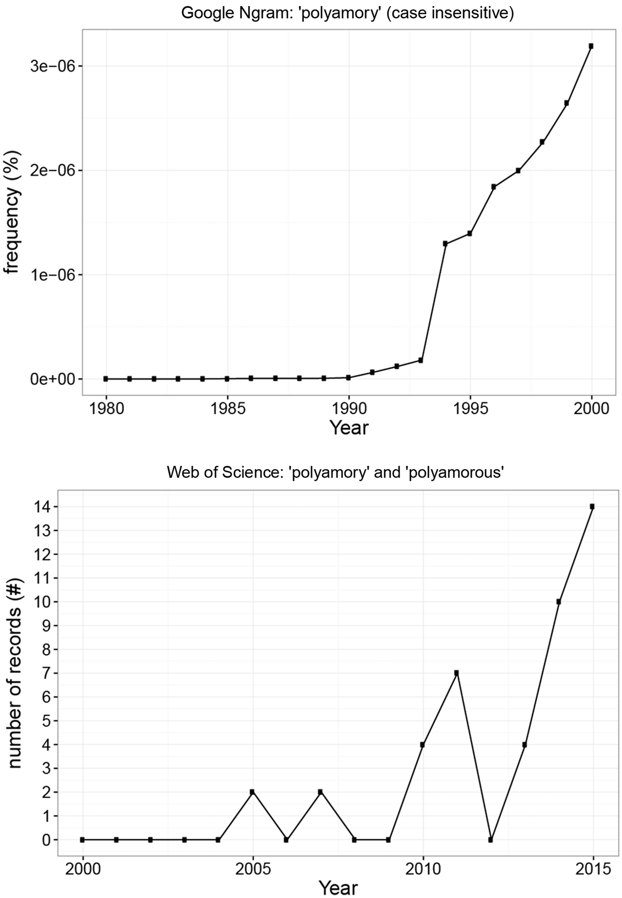

PREPRINT (IN PRESS, ACCEPTED APRIL 9, 2018). CITE AS:  
Rubel AN and Burleigh TJ (2018) Counting polyamorists who count: Prevalence and definitions of an under-researched form of consensual nonmonogamy. _Sexualities_, 21(8), 1248-1268. doi: 10.1177/1363460718779781

# Counting polyamorists who count: Prevalence and definitions of an under-researched form of consensual nonmonogamy

Alicia N Rubel  
_Department of Psychology, Brock University, St. Catharines, Canada_  
Correspondence may be sent to Alicia Rubel at ar10hd@brocku.ca.

Tyler J Burleigh  
_Department of Psychology, University of Guelph, Guelph, Canada_

---

## Abstract

Despite a growing interest in polyamory, it is unknown how many polyamorists there are in the general population. In acknowledging that the meaning of ‘polyamory’ is contested (e.g. Klesse, 2014), we estimated the prevalence of polyamory when it was defined as: (1) an identity, (2) relationship beliefs/preferences, (3) relationship status, and (4) relationship agreements. We recruited 972 individuals from Mechanical Turk and used a sample weighting procedure to approximate a representative sample of the United States population. Point prevalence estimates ranged from about 0.6% to 5%, and lifetime estimates ranged from about 2% to 23%. Thus, we estimate that there are at least 1.44 million adults in the USA who count as polyamorous.

**Keywords:** consensual nonmonogamy, identity, polyamory, prevalence, relationships

---

Broadly defined, polyamory is the practice of, belief in, or willingness to engage in multiple simultaneous romantic and/or sexual relationships with the consent of everyone involved. The interest in polyamory is growing, as evidenced by an increasing usage in English corpora as well as in the scholarly literature (see Figure 1). Indeed, between 1984 and 2015 there have been at least 42 popular nonfiction books published on the topic, seven of which were published in 2014 and 2015 alone (M, 2014a). However, despite this growing interest, it is still unknown how many polyamorists there are in the general population. This is complicated by the multiplicity of definitions of polyamory (Klesse, 2006, 2011, 2014). In the present article, we aim to estimate the prevalence of polyamory according to these various definitions.

To the best of our knowledge, there are only two prevalence estimates of polyamory, and neither has been through a peer-review process of scrutiny. The first estimate, 2.3%, was calculated in 2009 using separate estimates of: 1) the prevalence of polyamory among bisexual individuals, 2) the prevalence of bisexuality among polyamorous individuals, and 3) the prevalence of bisexuality in the general population (M, 2014b). However, this estimate likely has a large margin of error because it is the product of three other estimates, two of which have large individual errors due to their small sample sizes. The second estimate, 7.1%, was obtained in 2015 by the Open Source Psychometrics Project (OSPP, 2015), a website that hosts various psychology tests that are open for anyone to participate in by visiting the website. Although their sample was large (N = 5043) and directly observed, it was also obtained from a population of individuals who take online personality tests, and therefore skewed young (66% was aged 13–25), atheist (47%), and non-heterosexual (14%). Given polyamory’s cultural and historical association with gay and sexual liberation (Easton & Hardy, 1997; Klesse, 2006, 2011), this estimate is likely to be an overestimate.

Given the overlap between definitions of consensual nonmonogamy and polyamory, the prevalence of consensual nonmonogamy may also be considered as an indicator of polyamory prevalence. Similar to polyamory (when defined as a practice or agreement), consensual nonmonogamy is often defined as a relationship, or relationship agreement, that permits individuals to have more than one sexual and/or romantic relationship at a time, with the knowledge and consent of everyone involved (e.g. Conley et al., 2013). Consensual nonmonogamy is an umbrella term that includes polyamory, but also other relationship practices like swinging and open relationships (Conley et al., 2013; Matsick et al., 2014; Moors et al., 2013). However, as with polyamory prevalence estimation, there have been few attempts to estimate the prevalence of consensual nonmonogamy. Early studies estimated the prevalence of individuals who practice consensual nonmonogamy to be between 4 and 5% (Conley et al., 2012), and a more recent study which combined Conley et al.’s (2012) dataset with Moors et al.’s (2014) estimated the prevalence to be 5.3% (Rubin et al., in press). However, in comparison to the general population, the demographics of this sample skewed young (_M_age = 27.7), white (76%), and female (69%); and sample weighting was not used to improve sample representativeness. A second limitation is that it is unknown what proportion of the consensual nonmonogamous population is polyamorous, and any estimate of consensual nonmonogamy prevalence is at best a ceiling for the estimate of polyamory prevalence.1

<small>1 See also, Haupert et al., 2016, which was published while this manuscript was under review and provides a lifetime prevalence rate for having had an "open sexual relationship"—a different sample than the target of this article.</small>

Who counts as polyamorous? The task of estimating polyamory prevalence is complicated by the contested nature of the term ‘polyamory’ (Klesse, 2006). In examining the literature, we encountered many definitions of polyamory (see Table 1), and these definitions appeared to cluster into four basic categories: 1) polyamory as beliefs or preferences, 2) polyamory as a relationship status, and 3) polyamory as a relationship agreement. For example, Sheff (2013) adopts a broad stance that acknowledges that polyamory may encompass any one (or more than one) of these aspects, while others have adopted much narrower definitions that only recognize polyamory as ‘something you do’ (e.g. Savage, 2012). Further, we observed that in addition to these categories, some definitions have also specified that polyamorous relationships must involve emotional intimacy, romantic love, or be long-term (presumably to distinguish polyamory from other forms of consensual nonmonogamy like swinging; see Klesse, 2006).

**Table 1.** Definitions of polyamory classified by type.

| Definition | Belief or Preference | Status | Agreement | Also requires love or long-term |
|---|:---:|:---:|:---:|:---:|
| "A relationship orientation that assumes that it is possible (and acceptable) to love many people and to maintain multiple intimate and sexual relationships." _Sexualities_ (2003, as cited in Barker, 2005) | X | | | ✓ |
| "Polyamory is a form of non-monogamy grounded in the belief in people's capacity to share and multiply their love in honest and consensual ways." Anderlini-D'Onofrio (2004, as cited in Ritchie & Barker, 2006) | X | X | | ✓ |
| "Polyamory is a lifestyle in which a person may pursue simultaneous romantic relationships, with the blessing and consent of each of their partners." (Weitzman, 2006) | | X | | |
| "Polyamory is the practice, desire, or acceptance of having more than one intimate relationship at a time with the knowledge and consent of everyone involved." (CPAA, 2013) | X | X | X | |
| "Polyamory means 'loving more than one.' This love may be sexual, emotional, spiritual, or any combination thereof, according to the desires and agreements of the individuals involved... 'Polyamorous' is also used as a descriptive term by people who are open to more than one relationship even if they are not currently involved in more than one. (Heck! some are involved in less than one.) Some people think the definition is a bit loose, but it's got to be fairly roomy to fit the wide range of poly arrangements out there!" (Matthesen, 1997) | X | X | X | ✓ |
| "Polyamory is a philosophy and lifestyle based around the forming and sustaining of relationships with multiple partners in an open, honest and non-possessive way." (Polyamory.org.uk, 2013) | X | X | | |
| "Polyamory describes a form of relationship where it is possible, valid and worthwhile to maintain (usually long-term) intimate and sexual relationships with multiple partners simultaneously." Haritaworn et al. (2006) | | X | | ✓ |
| "Polyamory (often shortened to 'poly')... its meaning is still a bit vague—some feel that polyamory includes all forms of sexual relationships other than monogamy, while others restrict it to committed love relationships (thereby excluding swinging, casual sexual contact, and other forms of intimacy)." Easton and Hardy (2009) | | X | | ✓ |
| "The word polyamory... means having multiple loving, often committed, relationships at the same time by mutual agreement, with honesty and clarity." Veaux et al. (2014) | | X | X | ✓ |
| "Polyamory is consensual, openly conducted, multiple-partner relationships in which both men and women have negotiated access to additional partners outside of the traditional committed couple... Some people do polyamory, meaning they see it as an option, a lifestyle, or even a form of sacred sexuality practice they may choose depending on the circumstances in their lives and relationships... For others, polyamory is a belief or worldview based on abundance, multiplicity, and freedom. In some cases, people who are new to the idea of polyamory practice it as a belief before finding a partner with whom they can practice it in action." Sheff (2013) | X | X | X | |
| "Polyamory circumscribes a relationship philosophy or an approach to intimacy and sexuality that is based on the belief that it is worthwhile and valid to have more than one loving or erotic relationship." Klesse (2011) | X | X | | |
| "'Poly is not a sexual identity... it's not a sexual orientation. It's not something you are, it's something you do. There's no such thing as a person who is 'a poly,' just as there's no such thing as a person who is 'a monogamous.' Polyamorous and monogamous are adjectives, not nouns... These are relationship models... not sexual identities." Savage (2012) | | X | X | |
| "Polyamory is a lifestyle embraced by a minority of individuals, who exhibit a wide variety of relationship models and who articulate an ethical vision that I understand to encompass five main principles: self-knowledge, radical honesty, consent, self-possession, and privileging love and sex over jealousy... In theory at least, a completely poly disposition might be understood to involve not only desires for multiple sexual and domestic partners, but desires for one's partner(s) to have multiple sexual and domestic partners." Emens (2004) | X | X | X | |

Depending on which definition is used, a different prevalence estimate would be obtained. For example, a narrow definition of polyamory as someone who is currently in multiple loving relationships would count many fewer individuals than would a broader definition that is based on an individual’s openness to having multiple relationships. While we could have proceeded in the present research to use only one of these definitions, it would be difficult to choose. At this point, there is no single conventional definition that is used by members of the polyamorous community, and as such we believe that it is important to conduct research that does not elevate the status of one definition over others. Moreover, by making use of multiple definitions in our research we can gain an understanding of multiple perspectives, practices, and experiences, each of which are interesting in their own right. Thus, we believed that it would be important to examine the prevalence polyamory, based on multiple definitions of polyamory.

In the present research, we aimed to estimate polyamory prevalence in the general population using the definitions identified above. In addition to this primary goal, we also performed exploratory analyses that examined how polyamory might be defined based on the perspectives and experiences of individuals who identify as polyamorous, in order to inform future research. We believe that estimating the prevalence of polyamory is a worthwhile undertaking for two reasons. First, knowing the prevalence of polyamory can inform our understanding of the diverse ways that humans form and think about romantic and sexual relationships. Second, individuals who practice consensual nonmonogamy are frequently stigmatized and misunderstood (Burleigh et al., 2017; Conley et al., 2012, 2013; Grunt-Mejer & Campbell, 2016; Hutzler et al., 2015; Moors et al., 2013; Matsick et al., 2014), and face discrimination in many situations, including employment and housing (Emens, 2004; Fleckenstein, Bergstrand, & Cox, 2012; Lesher, 2013; Nearing, 2000). Estimating the size of the polyamory population tells us how many individuals in the general population might benefit from public policy and research agendas that address these issues. If this population is relatively large, then the estimate could be used to strengthen the argument that such policies and agendas are valuable by demonstrating that a substantial portion of the population might benefit from them. Although we believe that all minorities are deserving of rights and freedoms regardless of their size, we appreciate the practical significance of this line of argument. Third, this estimate can be used to help service providers to plan for services to polyamorous individuals by letting them know how many individuals might use their services (e.g. sexual health counselling tailored to polyamorists).

---

## Method

### Participants

A total of 972 participants were recruited from Amazon’s Mechanical Turk (MTurk) during the summer of 2013 for a survey that was advertised as being about ‘the different styles of relationships that people have’. As eligibility criteria, participants were required to be residents of USA (based on having provided valid taxpayer identification to Amazon), and have had a task approval rate of at least 90% for previous MTurk tasks (this was used to ensure high quality data; see Peer et al., 2014). We also sought to minimize time-based sample variation by splitting the total data collection into 10 smaller batches and deploying these at different times of day and days of the week (see Casey et al., 2017).2 The survey, described in the materials section, took about 10 minutes to complete, and participants were paid $0.75 USD.

<small>2 Specifically, we posted 10 batches with 100 slots each at the following days and times (Eastern Standard Time): Sunday at 1 p.m., Monday at 10 a.m., Tuesday at 11 p.m., Wednesday at 7:30 p.m., Thursday at 8 p.m., Friday at 11 p.m., Saturday at 12 p.m., Sunday at 8 p.m., Monday at 3 p.m., and Tuesday at 4 p.m.</small>

Our decision to use MTurk as a source of data was motivated by several considerations. First, the MTurk population is demographically diverse, and while it is not representative of the general US population, MTurk samples can be weighted to approximate a representative sample. Previous research has found that MTurk samples are more diverse than other convenience samples like those obtained from student or community populations (Berinsky et al., 2012; Buhrmester et al., 2011; Chandler & Shapiro, 2016; Paolacci et al., 2010). Although MTurk samples are not demographically representative of the general population, the discrepancy is comparable to samples obtained from professional Internet panels like those obtained by the companies SurveyMonkey and Qualtrics (Heen et al., 2014), and researchers have had success with using poststratification weighting to enhance representativeness (Levay et al., 2016; Simons & Chabris, 2012). Second, MTurk is cost-effective. According to Mullinix et al. (2015), it can cost more than $15,000 to conduct even a brief survey with a population-based sample, while a comparable sample can be recruited from MTurk for only $500. Finally, MTurk affords anonymity to participants (or at least a _sense_ of anonymity, as participants are technically pseudonymous), and is therefore appropriate for collecting information from individuals who represent stigmatized and concealable identities (Smith et al., 2015)—as is the case with polyamory.

### Materials

The survey asked participants demographic questions (age, sex, ethnicity, household income, education, sexual orientation, and feminist identity) and questions about their relationships. The relationship questions included: 1) relationship status, 2) consensual nonmonogamy identity (e.g. polyamorous), 3) the nature of their relationship agreement(s), and 4) their beliefs about relationships. In order to facilitate both point and lifetime prevalence estimation, participants were asked the relationship questions with respect to both past and present circumstances. Finally, participants were also asked about their knowledge of the term ‘polyamory’. Survey branch logic was used to dynamically present relevant questions to participants. For example, only participants who indicated that they were in a relationship were then asked to indicate the characteristics of that relationship. Thus, not all participants answered all questions. See Appendix A for the survey questions and branch logic. To assess the prevalence of polyamory according to the four definitions identified earlier, we examined responses as follows:

1. **Identity:** To assess polyamory as an identity, we examined responses to a question that asked participants whether or not they identified as: polyamorous/polyamorist, swinger, or non-monogamist (participants were allowed to select multiple options).

2. **Relationship beliefs/preferences:** To assess polyamory as relationship beliefs/preferences, we examined responses to the question: ‘I currently believe that it is [In the past I believed that it was] ________ for me personally [a partner of mine/people in general] to have more than one romantically intimate relationship at a time, with the knowledge and consent of everyone involved’ (bracketed portions indicate separate questions). Response options were: possible, acceptable, desirable, and none of the above; and participants could select multiple options. We examined responses that indicated the belief that it was: 1) possible, 2) possible and acceptable, and 3) possible and acceptable and desirable.

3. **Relationship agreement:** To assess polyamory as a relationship agreement, we examined responses to the following questions: ‘I am currently in a relationship [In the past, I have been in a relationship] where my partner and I explicitly agree[d] that it [is / was] ________ to have more than one romantically intimate relationship at a time [to have more than one sexual relationship at a time / to experience romantic love for more than one person at the same time], with the knowledge and consent of everyone involved’ (bracketed portions indicate separate questions). Response options were: possible, acceptable, desirable, and none of the above; and participants could select multiple options. We examined responses that indicated an agreement where it was: 1) possible, 2) possible and acceptable, and 3) possible and acceptable and desirable. Further, we examined responses to questions that asked participants to describe the relationship(s) in which they had this agreement: sexual, romantic, loving, long-term, intimate, or marriage; and participants could select multiple options.

4. **Relationship status:** To assess polyamory as a relationship status, we examined responses to the following questions: ‘Are you currently in [In the past, have you ever been in] multiple sexual and/or romantic relationships, with the knowledge and consent of everyone involved?’ (Yes/No), and ‘Do you [Did you] consider any [more than one] of your multiple simultaneous relationships to be sexual, romantic, loving, long-term intimate and/or a marriage?’ Response options were: sexual, romantic, loving, long-term, intimate, and marriage; and participants could select multiple options.

### Sample Weighting

Our analyses were performed using SPSS 22 (IBM Corp, 2013). We used the SPSS _rake_ extension to weight our sample to the 2012 U.S. Census, using age, ethnicity, sex, income, and education as weighting variables. SPSS rake implements a form of poststratification weighting called _random iterative method_ (or _iterative proportional fitting_; as described in Grover & Vriens, 2006), that assigns weights to individual cases in order to enhance the representativeness of the sample. Higher weights are given to individuals in the sample who are underrepresented relative to the general population, and lower weights are given to individuals who are overrepresented. For example, if the population distribution of sex was known to be 50% female / 50% male, and the sample was 30% female / 70% male, then each female in the sample would be given a weight of 1.67 (50/30), and each male would be given a weight of 0.71 (50/70). When multiple weighting variables are used, the method adjusts the sample to the population on all variables simultaneously. By adjusting the sample to match the general population, more valid inferences can be made about characteristics of the general population (Levay et al., 2016; Simons & Chabris, 2012).

---

## Results

### Demographics

We first compared the demographics of our sample to those of the 2012 U.S. Census, in order to determine to what extent our sample differed from the general population. When all demographic variables and brackets within variables were considered, the average discrepancy was 5.5 percentage points (age = 6.6, ethnicity = 5.0, sex = 4.3, income = 2.3, and education = 12.4). The largest individual bracket discrepancies (15–20 percentage points) were observed with age and education, reflecting an overrepresentation of the 20–24 and 25–29 age brackets, and the college and bachelor degree education brackets. In addition, the White (not Hispanic) ethnicity and $100,000+ income brackets observed discrepancies between 10–15 percentage points. The remaining discrepancies were less than 10 percentage points each. See Table 2 for a summary.2 Given these findings, it seemed reasonable to proceed with the weighted sample analysis.

<small>2 It is also worth noting that 11% of our sample identified as non-heterosexual (4.8% = [gay, lesbian, or homosexual], 8.5% = [bisexual, queer, pan or polysexual], 1.7% = questioning, 1.0% = asexual, and <1.0% = demisexual), and 27.3% identified as feminist (a philosophy associated with polyamory; Haritaworn, Lin, & Klesse, 2006).</small>

**Table 2.** Demographics in MTurk sample vs. 2012 US Census.

| Variable | MTurk | Census | Difference |
|---|---|---|---|
| **Age** | | | |
| 18 (15) to 19 years\* | 5.3 | 6.9 | −1.6 |
| 20 to 24 years | 26.0 | 7.1 | 18.9 |
| 25 to 29 years | 24.2 | 6.8 | 17.4 |
| 30 to 34 years | 15.7 | 6.6 | 9.1 |
| 35 to 39 years | 9.4 | 6.2 | 3.2 |
| 40 to 44 years | 7.5 | 6.7 | 0.8 |
| 45 to 49 years | 4.0 | 7.0 | −3.0 |
| 50 to 54 years | 3.1 | 7.2 | −4.1 |
| 55 to 59 years | 2.7 | 6.6 | −3.9 |
| 60 to 64 years | 1.0 | 5.7 | −4.7 |
| 65 to 69 years | 0.7 | 4.4 | −3.7 |
| 70 and older | 0.3 | 9.1 | −8.8 |
| **Ethnicity** | | | |
| White (not Hispanic) | 76.2 | 63.1 | 13.1 |
| White (Hispanic) | 7.3 | 14.9 | −7.6 |
| Black | 8.6 | 13.1 | −4.5 |
| Native American | 5.3 | 1.2 | 4.1 |
| Asian | 0.4 | 5.1 | −4.7 |
| Native Hawaiian/Islander | 0.3 | 0.2 | 0.1 |
| Multiracial | 1.7 | 2.4 | −0.7 |
| **Sex** | | | |
| Female | 46.7 | 51 | −4.3 |
| Male | 53.3 | 49 | 4.3 |
| **Income** | | | |
| less than $10,000 | 7.9 | 7.3 | 0.6 |
| $10,000 to $14,999 | 6.4 | 5.7 | 0.7 |
| $15,000 to $19,999 | 6.3 | 5.8 | 0.5 |
| $20,000 to $24,999 | 7.6 | 5.8 | 1.8 |
| $25,000 to $29,999 | 6.8 | 5.5 | 1.3 |
| $30,000 to $34,999 | 8.2 | 5.2 | 3.0 |
| $35,000 to $39,999 | 5.1 | 4.8 | 0.3 |
| $40,000 to $44,999 | 6.5 | 4.5 | 2.0 |
| $45,000 to $49,999 | 5.2 | 4.3 | 0.9 |
| $50,000 to $59,999 | 11.6 | 7.6 | 4.0 |
| $60,000 to $74,999 | 9.6 | 9.8 | −0.2 |
| $75,000 to $99,999 | 9.5 | 11.7 | −2.2 |
| $100,000 or more | 9.3 | 22.0 | −12.7 |
| **Education** | | | |
| Less than a high school diploma | 0.9 | 13.2 | −12.3 |
| High school diploma or equivalent | 11.9 | 30.0 | −18.1 |
| Some college or associate's degree | 43.6 | 28.6 | 15.0 |
| Bachelor's degree or equivalent | 34.5 | 18.4 | 16.1 |
| Graduate degree or higher | 9.1 | 9.8 | −0.7 |

‡The MTurk age range was 18 to 19, while the Census range was 15 to 19.

### Prevalence of Polyamory

First, we examined the prevalence of polyamory when defined as an identity. We found that 0.59% of participants in the weighted sample currently identified as polyamorous or a polyamorist, and 1.79% identified as polyamorous or a polyamorist at some point in their life. By comparison, 2.35% currently identified as swingers, 2.50% as nonmonogamist, and 5.09% as any one of the non-monogamous options; lifetime prevalence was 4.76% for swinger, 8.81% for nonmonogamist, and 12.85% for any one of the nonmonogamous options.3

<small>3 It is also worth noting that 11% of our sample identified as non-heterosexual (4.8% = [gay, lesbian, or homosexual], 8.5% = [bisexual, queer, pan or polysexual], 1.7% = questioning, 1.0% = asexual, and <1.0% = demisexual), and 27.3% identified as feminist (a philosophy associated with polyamory; Haritaworn, Lin, & Klesse, 2006).</small>

Second, we examined the prevalence of polyamory when defined as relationship beliefs/preferences. A broad definition might be indicated by the belief that it is both _possible_ and _acceptable_ to have consensual romantic relationships with others. Along these lines, we found that 4.31% of participants believed that it was possible and acceptable for themselves, and 3.91% believed that it was possible and acceptable for their partner(s). Lifetime prevalence (beliefs held now or in the past) was 7.92% for the self and 7.53% for their partner(s). A narrower definition, which incorporates the notion of preference, would be indicated by the belief that it is possible, acceptable, and also _desirable_ to have consensual romantic relationships with others. We found that 2.60% of participants held these beliefs for themselves, and 1.46% held these beliefs for their partner(s). Lifetime prevalence was 5.64% for the self and 3.60% for their partner(s). For a summary that includes unweighted estimates, see Table 3.4

<small>4 The unweighted estimates were as follows: 1.64% currently identified as polyamorous/polyamorist, 1.23% as swingers, 2.57% as nonmonogamist, and 4.11% as any one of the nonmonogamous options. For lifetime prevalence, 3.70% identified as polyamorous/polyamorist, 2.36% as swingers, 5.75% as nonmonogamist, and 8.83% as any one of the nonmonogamous options.</small>

Third, we examined the prevalence of polyamory when defined as a relationship agreement. Among the participants who indicated that they were currently in a relationship, 9.68% (5.57% of the total weighted sample; 5.03% unweighted) answered that they had a consensually nonmonogamous agreement with a partner. Lifetime prevalence (currently or in the past) was 23.00%. Given that some definitions of polyamory specify that love is essential, participants were asked to indicate which adjective(s) they would use to describe the relationship(s) in which they had the consensually nonmonogamous agreement(s). The poly-relevant adjectives were: sexual, romantic, loving, long-term, intimate (marriage was included for reference). That is to say, polyamory might be defined as a relationship that permits nonmonogamy which can be described by any one of these adjectives. We found that each of these descriptors was used by about 5% of the total weighted sample (‘sexual’ was the highest at 5.33%, and ‘loving’ was the lowest at 4.84%). For lifetime prevalence, ‘sexual’ was used by 15.04% of the total weighted sample, ‘romantic’ and ‘intimate’ by about 10%, and ‘loving’ and ‘long-term’ by about 8%. For a summary that includes unweighted estimates and the marriage descriptor, see Tables 4a and 4b.5

<small>5 Notably, only 39.22% of the participants stated that it was acceptable for people in general to engage in consensual nonmonogamy, confirming that consensually non-monogamous relationships are frequently devalued.</small>

**Table 3.** Point and lifetime prevalence of polyamory when defined as relationship beliefs. Responses to the questions stating: "I currently believe that it is (in the past I believed that it was) \_\_\_\_\_\_\_\_ for me personally (a partner of mine/people in general) to have more than one romantically intimate relationship at a time, with the knowledge and consent of everyone involved" (bracketed portions indicate separate questions).

| Response | Me personally | A partner of mine | People in general |
|---|---|---|---|
| **Point prevalence ("I currently believe that it is \_\_\_\_\_\_\_\_")** | | | |
| Possible | 28.75 (25.16) | 25.56 (22.64) | 64.07 (61.18) |
| Possible & acceptable | 8.62 (4.31) | 7.39 (3.91) | 25.36 (19.89) |
| Possible, acceptable & desirable | 2.46 (2.60) | 1.44 (1.46) | 5.85 (5.94) |
| **Lifetime prevalence ("In the past I believed that it was \_\_\_\_\_\_\_\_")** | | | |
| Possible | 39.73 (33.97) | 35.01 (30.97) | 68.89 (63.7) |
| Possible & acceptable | 12.42 (7.92) | 10.78 (7.53) | 28.34 (21.38) |
| Possible, acceptable & desirable | 5.54 (5.64) | 2.57 (3.60) | 8.32 (7.75) |

_Note:_ Figures in parentheses are the weighted estimates of percentage in population.

Third, we examined the prevalence of polyamory when defined as a relationship agreement. Among the participants who indicated that they were currently in a relationship, 9.68% (5.57% of the total weighted sample; 5.03% unweighted) answered that they had a consensually nonmonogamous agreement with a partner. Lifetime prevalence (currently or in the past) was 23.00%. Given that some definitions of polyamory specify that love is essential, participants were asked to indicate which adjective(s) they would use to describe the relationship(s) in which they had the consensually nonmonogamous agreement(s). The poly-relevant adjectives were: sexual, romantic, loving, long-term, intimate (marriage was included for reference). That is to say, polyamory might be defined as a relationship that permits nonmonogamy which can be described by any one of these adjectives. We found that each of these descriptors was used by about 5% of the total weighted sample (‘sexual’ was the highest at 5.33%, and ‘loving’ was the lowest at 4.84%). For lifetime prevalence, ‘sexual’ was used by 15.04% of the total weighted sample, ‘romantic’ and ‘intimate’ by about 10%, and ‘loving’ and ‘long-term’ by about 8%. For a summary that includes unweighted estimates and the marriage descriptor, see Tables 4a and 4b.

**Table 4a.** Point and lifetime prevalence of polyamory when defined as a type of relationship agreement. In the first column, each cell indicates the percentage of participants in the total sample who have a nonmonogamous agreement with a partner and who would use this adjective to describe their relationship with this partner. The second column describes the breakdown of just those participants who have a nonmonogamous agreement with a partner.

| Adjective | % of Ps in total sample | % of Ps in relationship with nonmonogamous agreement |
|---|---|---|
| **Point prevalence (current relationship(s))** | | |
| Sexual | 4.11 (5.33) | 81.63 |
| Romantic | 3.39 (5.18) | 67.35 |
| Loving | 3.08 (4.84) | 61.22 |
| Long-term | 2.77 (4.88) | 55.10 |
| Intimate | 3.38 (5.01) | 67.35 |
| Marriage | 1.13 (0.57) | 22.45 |
| **Lifetime prevalence (current and past relationship(s))** | | |
| Sexual | 19.81 (15.04) | 86.16 |
| Romantic | 9.86 (9.71) | 42.86 |
| Loving | 8.01 (7.47) | 34.82 |
| Long-term | 7.60 (8.33) | 33.04 |
| Intimate | 10.16 (10.61) | 44.20 |
| Marriage | 1.85 (0.70) | 8.04 |

_Note:_ Figures in parentheses are the weighted estimates of percentage in population.

**Table 4b.** Point and lifetime prevalence of polyamory when defined as a type of relationship agreement. "I am currently in a relationship (In the past, I have been in a relationship) where my partner and I explicitly agree(d) that it (is/was) \_\_\_\_\_\_\_\_ to have more than one romantically intimate relationship at a time (to have more than one sexual relationship at a time/to experience romantic love for more than one person at the same time), with the knowledge and consent of everyone involved" (bracketed portions indicate separate questions).

| Response | Have romantic relationships | Have sexual relationships | Experience romantic love |
|---|---|---|---|
| **Point prevalence ("I am currently in a relationship where my partner and I explicitly agree that it is \_\_\_\_\_\_\_\_")** | | | |
| Possible | 4.11 (5.22) | 5.85 (8.61) | 6.16 (9.95) |
| Possible & acceptable | 1.33 (1.50) | 1.85 (1.61) | 1.33 (1.57) |
| Possible, acceptable & desirable | 0.62 (1.41) | 1.03 (1.44) | 0.31 (1.20) |
| **Lifetime prevalence ("In the past, I have been in a relationship where my partner and I explicitly agreed that it was \_\_\_\_\_\_\_\_")** | | | |
| Possible | 13.24 (14.74) | 17.25 (16.28) | 19.81 (18.50) |
| Possible & acceptable | 6.06 (7.60) | 8.52 (8.24) | 5.03 (2.80) |
| Possible, acceptable & desirable | 2.57 (3.11) | 4.21 (3.81) | 1.85 (1.84) |

_Note:_ Figures in parentheses are the weighted estimates of percentage in population.

A second line of questions that we asked participants to assess polyamorous relationship agreements, was whether they were in a relationship in which they and their partner had explicitly agreed that it was possible, acceptable, and/or desirable to engage in several consensually nonmonogamous behaviours. Recall that polyamory is sometimes defined as loving multiple persons. The behaviours that we asked about were whether they: 1) have more than one consensual _romantic_ relationship at a time, 2) have more than one consensual _sexual_ relationship at a time, and/or 3) consensually experience romantic love for more than one person at the same time. A broad definition of polyamory would be where partners agree that at least one of these three consensually nonmonogamous behaviours is _possible_ and _acceptable_. Along these lines, we found that about 1.5% (range: 1.5% to 1.61%) of participants currently had an agreement where at least one of the behaviours was possible and acceptable. For lifetime prevalence, about 8% had agreed that multiple consensual sexual or romantic relationships were possible and acceptable; whereas only 2.8% had agreed with their partner that it was possible and acceptable to experience romantic love for more than one person at a time. A narrower definition of polyamory would be the agreement that it is possible, acceptable, and also _desirable_, to engage in one of the three consensually nonmonogamous behaviours. Here we observed similar point estimates: about 1.35% (range: 1.2% to 1.44%) currently had an agreement where at least one of the behaviours was possible, acceptable, and desirable. For lifetime prevalence, 3.5% had at some point agreed with a partner that multiple consensual sexual or romantic relationships were possible, acceptable, and desirable; whereas only 1.84% had at some point agreed with a partner that it was possible, acceptable, and desirable to experience romantic love for more than one person at a time. For a summary that includes unweighted estimates, see Table 4b.

Finally, we examined the prevalence of polyamory when defined as a relationship status; 4.12% (2.26% unweighted) answered that they were currently in multiple consensual sexual and/or romantic relationships. Lifetime prevalence was 18.44% (16.53% unweighted). Again, because some definitions specify that polyamorous relationships are loving or long-term in nature, participants were asked to indicate if any [more than one] of their multiple consensually nonmonogamous relationships could be described as sexual, romantic, loving, long-term, or intimate. When asked to describe _any_ of their consensually nonmonogamous relationships, each of the poly-relevant descriptors was used by about 4% of the total sample; the results were also about 4% each when participants were asked to describe _more than one_ of their consensually nonmonogamous relationships. In terms of lifetime prevalence, when participants were asked to describe _any_ of their multiple consensually nonmonogamous relationships in the past or present, ‘sexual’ was used by 18.19% of the total weighted sample, ‘loving’ by 12.44%, followed by ‘romantic,’ ‘long-term,’ and ‘intimate’ which were each used by about 8%. When participants were asked to describe _more than one_ of their multiple consensually nonmonogamous relationships in the past or present, ‘sexual’ was used by 16.91% of the total weighted sample, ‘loving’ by 10.61%, ‘intimate’ and ‘romantic’ by about 7.5%, and ‘long-term’ by 5.72%. For a summary that includes unweighted estimates and the marriage descriptor, see Table 5.

**Table 5.** Point and lifetime prevalence of polyamory when defined as a relationship status. The first two columns represent the percentage of participants in the total sample who are in multiple consensual sexual and/or romantic relationships who would describe any or more than one of their relationships using the descriptor indicated. The third and fourth columns represent just those participants who are in multiple consensual sexual and/or romantic relationships. (CNM = consensually nonmonogamous).

| Relationship Type | % of Ps in total sample: Any | % of Ps in total sample: More than one | % of Ps in multiple CNM Relationships: Any | % of Ps in multiple CNM Relationships: More than one |
|---|---|---|---|---|
| **Point prevalence (current relationship(s))** | | | | |
| Sexual | 1.85 (4.10) | 1.85 (4.10) | 81.82 | 81.82 |
| Romantic | 1.23 (3.78) | 1.03 (3.68) | 54.54 | 45.45 |
| Loving | 1.13 (3.76) | 0.41 (3.32) | 50.00 | 18.18 |
| Long-term | 0.82 (3.74) | 0.61 (3.73) | 36.36 | 27.27 |
| Intimate | 1.13 (3.85) | 1.03 (3.77) | 50.00 | 45.45 |
| Marriage | 0.51 (0.32) | 0.00 (0.00) | 22.73 | 0.00 |
| **Lifetime prevalence (current and past relationship(s))** | | | | |
| Sexual | 15.30 (18.19) | 14.68 (16.91) | 92.55 | 88.82 |
| Romantic | 6.47 (7.75) | 4.21 (7.12) | 39.13 | 25.47 |
| Loving | 8.11 (12.44) | 2.87 (10.61) | 49.07 | 17.39 |
| Long-term | 4.82 (7.39) | 1.85 (5.72) | 29.19 | 11.18 |
| Intimate | 7.80 (8.45) | 5.34 (7.71) | 47.20 | 32.30 |
| Marriage | 1.33 (1.29) | 0.41 (0.25) | 8.07 | 2.48 |

_Note:_ Figures in parentheses are the weighted estimates of percentage in population.

---

### Participants’ Understanding of What ‘Polyamory’ Means

Importantly, our estimate of the prevalence of polyamorous-identified individuals must be qualified by participants’ understanding of what ‘polyamory’ means, because it is likely that more individuals who meet other definitions of polyamory would identify as polyamorous if they understood what it meant. To assess participants’ understanding of polyamory, we coded the responses to the open-ended question that asked participants to define polyamory. Responses were coded as having a _basic_ understanding of polyamory if they mentioned multiple partners (romantic or sexual) or mentioned being in love with multiple individuals, and if they also did not imply that it necessarily involved marriage. For example, one representative response was:

> “Polyamory is being in love with two or more people at the same time, and being in simultaneous relationships with two or more people at the same time.”

We also coded responses as having a _comprehensive_ understanding of polyamory if they also mentioned consent in their response. For example, one respondent said polyamory was:

> “A non-monogamous relationship or desire to have one such relationship including multiple romantic partners at the same time, with all partners being aware of the situation.”

We chose to code accuracy of the definitions using the above requirements based on our observations of how polyamory has been defined in past research and popular literature (see Table 1). Having multiple partners or loves is clearly central to the common understanding of polyamory. In addition, as can be seen by the table, most works emphasize that polyamory refers to consensual nonmonogamy rather than surreptitious behaviour. This focus on consent and honesty is typically seen as a key principle of polyamory (e.g. Emens, 2004). Although there are some debates regarding how polyamory should be defined, whether or not it involves nonconsensual nonmonogamy (i.e. cheating) is not one of them (Emens, 2004; Klesse, 2006; 2014).

Although some of the participants who gave a correct basic definition of polyamory likely knew that this arrangement requires consent but excluded this information for the sake of brevity, including a more restrictive comprehensive category gives us a more conservative estimation of the number of people who are familiar with the definition of polyamory. Interrater agreement was acceptable (Cohen, 1960) on both coding variables (basic understanding κ = .996; comprehensive understanding κ = .991). We found that 38.6% of participants (51.7% unweighted) reported a basic understanding of polyamory, and 14.7% (13.6% unweighted) reported a comprehensive understanding of polyamory.

---

### What does Polyamory Mean to Polyamorists?

Although our sample of self-identified polyamorists was small (N = 16), we believed that it would be worth examining what polyamory meant to these individuals. Thus, we performed two exploratory analyses on the unweighted sample to provide preliminary data relevant to this question.

First, we examined responses to a question that asked polyamorous-identified participants what polyamory meant to them (‘to me, polyamory is’). The response options were: 1) ‘innate (i.e. some people are born polyamorous)’, 2) ‘a system of beliefs’, 3) ‘a practice or lifestyle (i.e. something that you do)’, 4) ‘something you feel’, and 5) ‘none of the above’; and participants could select multiple options. We found that 94% of polyamorists stated that polyamory was a practice or lifestyle, 63% stated that it was a system of beliefs, 50% stated that it was something one feels, 44% stated that it was innate, and 6% stated that it was none of these options.

Next, we examined to what extent the non-identity based aspects of polyamory could predict polyamorous self-identification. We performed a hierarchical logistic regression in which the dependent variable was identification as ‘polyamorous’ or ‘polyamorist’ vs. neither (coded as 0 or 1). We began by entering the broadest criteria that could be used to define polyamory, and then at each successive step we added progressively more restrictive criteria. To reduce potential multicollinearity and to limit the number of predictors in the model, some of the definitional factors were combined into ordinal variables and others were excluded. Specifically, we entered: 1) beliefs about what is possible and acceptable for people in general (general beliefs), 2) beliefs about what is acceptable for oneself and one’s partner (personal beliefs), 3) the presence or absence of a consensually nonmonogamous agreement (multiple relationships), 4) the status of being in multiple consensually nonmonogamous relationships (multiple relationships), 5) whether participants loved one of their partners (one love), 6) whether participants had an agreement with their partner where it was possible, acceptable, and/or desirable to love more than one person at a time (multiple love agreement), and 7) whether participants loved more than one of their partners (multiple love). Thus, this regression allowed us to determine at what steps using an increasingly restrictive definition of polyamory better predicted identification as polyamorous/a polyamorist.

The results of the regression were as follows. At Step 1, the belief that polyamory is acceptable for people in general significantly predicted polyamorous identification (B = .97, p = .008). At Step 2, personal beliefs about the acceptability of polyamory significantly predicted polyamorous identification (B = 1.36, p < .001), while general beliefs were no longer significant (B = .09, p = .841). The addition of variables in Steps 3–7 did not improve the predictive ability of the model as none of the variables reached significance (ps > .05). Correlations between the predictors in our model are presented in Table 6, and a summary of model coefficients is presented in Table 7.

**Table 6.** Correlations between variables in model predicting polyamorous identification. (CNM = consensually nonmonogamous).

| | PolyIdent | BeliefGeneral | BeliefPersonal | AgreeCNM | MultiRelat | OneLove | AgreeMultiLove |
|---|---|---|---|---|---|---|---|
| BeliefGeneral | .091\*\* | | | | | | |
| BeliefPersonal | .236\*\* | .354\*\* | | | | | |
| CNMAgree | .155\*\* | .104\*\* | .327\*\* | | | | |
| MultipleRelat | .198\*\* | .039 | .249\*\* | .534\*\* | | | |
| OneLove | .139\*\* | .040 | .198\*\* | .331\*\* | .703\*\* | | |
| AgreeMultiLove | .188\*\* | .147\*\* | .392\*\* | .524\*\* | .379\*\* | .296\*\* | |
| MultiLove | −.008 | .009 | .124\*\* | .206\*\* | .422\*\* | .297\*\* | .130\*\* |

_Note:_ \*\* = _p_ < .01 (2-tailed).

**Table 7.** Summary of stepwise logistic regression model predicting polyamorous identification.

| Variable | B (SE) | Exp(B) | p |
|---|---|---|---|
| **Step 1** | | | |
| BeliefGeneral | .967 (.364) | .005 | .008 |
| **Step 2** | | | |
| BeliefGeneral | .059 (.459) | 1.060 | .898 |
| BeliefPersonal | 1.360 (.318) | 3.896 | <.001 |
| **Step 3** | | | |
| BeliefGeneral | .092 (.459) | 1.096 | .841 |
| BeliefPersonal | 1.201 (.346) | 3.323 | .001 |
| AgreeCNM | .791 (.688) | 2.205 | .250 |
| **Step 4** | | | |
| BeliefGeneral | .130 (.462) | 1.138 | .779 |
| BeliefPersonal | 1.137 (.352) | 3.118 | .001 |
| AgreeCNM | .043 (1.018) | 1.044 | .966 |
| MultiRelat | 1.366 (1.093) | 3.920 | .211 |
| **Step 5** | | | |
| BeliefGeneral | .130 (.461) | 1.139 | .779 |
| BeliefPersonal | 1.156 (.354) | 3.176 | .001 |
| AgreeCNM | .004 (1.033) | 1.004 | .997 |
| MultiRelat | 1.704 (1.292) | 5.498 | .187 |
| LoveOne | −.610 (1.276) | .543 | .633 |
| **Step 6** | | | |
| BeliefGeneral | .130 (.462) | 1.139 | .778 |
| BeliefPersonal | 1.156 (.361) | 3.178 | .001 |
| AgreeCNM | .008 (1.147) | 1.008 | .994 |
| MultiRelat | 1.705 (1.294) | 5.501 | .188 |
| LoveOne | −.608 (1.312) | .545 | .643 |
| LoveAgree | −.004 (.522) | .996 | .994 |
| **Step 7** | | | |
| BeliefGeneral | .098 (.465) | 1.103 | .833 |
| BeliefPersonal | 1.177 (.363) | 3.246 | .001 |
| AgreeCNM | .024 (1.145) | 1.024 | .983 |
| MultiRelat | 1.918 (1.332) | 6.811 | .150 |
| LoveOne | −.319 (1.353) | .727 | .813 |
| LoveAgree | −.057 (.515) | .945 | .912 |
| MultiLove | −20.072 (19024.828) | .000 | .999 |

_Note:_ CNM = consensually nonmonogamous.

---

## Discussion

### Prevalence

In the present study, we sought to estimate polyamory prevalence when polyamory was defined in several different ways. Specifically, when polyamory was defined as: (1) an identity, (2) relationship beliefs/preferences, (3) relationship status, and (4) relationship agreements. We found that the point and lifetime prevalence estimates varied based on how broadly or narrowly polyamory was defined. The point estimates ranged from about 0.6% to about 5%, while the lifetime estimates ranged from about 2% to 23%. The lowest point estimates were observed when polyamory was defined as an identity, while the highest point estimates were observed when polyamory was defined as relationships with a consensual nonmonogamy agreement which could be described as either sexual, romantic, intimate, loving, or long-term (each of which obtained similar estimates). Similarly, the lowest lifetime estimates were observed when polyamory was defined as an identity, while the highest lifetime estimate was observed when polyamory was defined as relationships with a consensual nonmonogamy agreement which participants described as sexual. Finally, intermediate prevalence estimates were observed when polyamory was defined as a relationship that permitted (or permitted and encouraged) different kinds of consensually nonmonogamous behaviours (sexual relationships, romantic relationships, or consensually loving multiple people), and when polyamory was defined as relationship beliefs. Thus, the question of how polyamory is defined is an important consideration for the task of prevalence estimation. Given both these findings and the contested nature of the term ‘polyamory’ (e.g. Klesse, 2006), we suggest that researchers should avoid elevating the status of any one definition of polyamory, and instead describe the prevalence of polyamory using multiple definitions or ranges.

Importantly, our data on the prevalence of polyamory as an identity must be qualified by participants’ understanding of ‘polyamory’ as a concept. We found that only about 39% of individuals had a basic understanding of polyamory (as involving multiple partners or loving multiple individuals), and only about 15% reported a comprehensive definition (as also involving consent). Insofar as the polyamorous-identified population tracks understanding of polyamory as a concept, this suggests that this population is likely to grow over time with increasing awareness.

As awareness grows, and social attitudes change, researchers should again estimate the prevalence of polyamory. Our estimates were derived from a convenience sample collected on the MTurk platform – a decision that was motivated by practical limitations like cost. We nonetheless believe the sample to have provided more robust estimates than those obtained in previous efforts. We made every effort to control sampling bias (as with our efforts to minimize time-based variation and our use of sample weighting), however despite these efforts our sample could still have had unknown biases. For these reasons, future estimates should be derived from a probability sample.

### Defining Polyamory

Beyond the task of identifying polyamory prevalence, our data also contributes to an ongoing debate about the nature of polyamory—that is, whether polyamory is ‘something you do’ or ‘something you are’ (Barker, 2005; Savage, 2012), with the latter case typically being seen as comparable to ‘sexual orientation’. Such a distinction is believed to have several practical implications. Defining polyamory as ‘something you are’ may help to achieve social acceptance, legal protections, custody rights, marriage equality, and other improvements in the treatment of polyamorists in society (Aviram & Leachman, 2015; Emens, 2004; Klesse, 2014; 2016; Tweedy, 2011). For example, Tweedy (2011) argued that members of a group are more likely to succeed with anti-discrimination claims if they can make the case that their situation is analogous to that of an oppressed racial group, which involves emphasizing how the group membership or identity is a core aspect of who they are (e.g. an immutable trait).

However, there are practical disadvantages to reducing polyamory to an immutable trait or absorbing it into the umbrella of ‘sexual orientation’ (Aviram & Leachman, 2015; Emens, 2004; Klesse, 2014; Klesse, 2016). Limiting the definition of polyamory in this way could fragment the social movements that polyamorists engage in, threaten the status of gender and sexual minorities, and undermine the more radical and transformative ideologies that polyamory is associated with. For example, Klesse (2014; 2016) argues that if polyamorists advocate for their rights using a restricted definition of polyamory, then any protections gained this way would apply only to a small minority of individuals, and those who fall outside of this definition may be pressured to conform in order to protect the image of polyamory. Alliances that exist between polyamorists, other consensual nonmonogamists, and individuals who have nontraditional families in other ways (e.g. single-headed families) would be lost. Essentially, polyamorists would be more likely to abandon their broader critique of relationship norms in favour of advocating for rights and protections for a select few.

Regardless of its practical implications, our results suggest that, for many polyamorists, polyamory can be seen not only as something that someone “does” (e.g. form multiple relationships), but as something a person “is”, similar to a sexual identity (a potentially innate preference) or a religious identity (a deeply held set of beliefs). Specifically, we found that of individuals who identified as polyamorous or a polyamorist (N = 16), 63% stated the opinion that polyamory was a set of beliefs, and 44% stated that polyamory was innate. Indeed, in our regression, relationship status did not predict polyamorous identity over and above beliefs. We would again argue for the advantages of a multiplicity of definitions, and for honouring the ways that polyamorous individuals define their own experiences of polyamory.

---

## Conclusion

Based on the most conservative polyamory prevalence estimate of 0.6% (those who explicitly identified as polyamorous or a polyamorist), and given that the size of the U.S. adult (18+) population was estimated to be 240 million (U.S. Census Bureau, 2012), it follows that there are _at least_ 1.44 million adults in the U.S. population who could be classified as polyamorous. As a point of comparison, Gates (2011) estimated that there were about 4 million individuals (1.7%) who identified as bisexual, 4 million (1.8%) who identified as lesbian or gay, and 700 thousand (0.3%) who identified as transgender; Bogaert (2004) estimated that 1.04% of the population meets the criteria for asexuality. Therefore, by our most conservative estimate, there are at least twice as many polyamorists as transgender individuals, and by our most inclusive estimates, there are many more polyamorists than gay or lesbian individuals. Thus, polyamorous individuals represent a substantial portion of the population.

---

## Acknowledgements

This research was supported by funding from the Ontario Public Interest Research Group, OPIRG-Guelph (opirgguelph.org) and OPIRG-Brock (opirgbrock.com) chapters. We would also like to thank Danielle Molnar for generously giving her time to instruct us on the use of rake weights.

---

## Statement of Research Ethics

This research was approved by the Research Ethics Board at Brock University (File #12-252).

---

## Reference List

Anderlini-D’Onofrio S (2004: 164-165) Polyamory, in J Eadie (Ed.) _Sexuality: The Essential Glossary_. London: Arnold.

Anderson S, Wandersee S, Arcenas A and Baumgartner L (2013) Craigslist samples of convenience: recruiting hard-to-reach populations. Retrieved September 6, 2016 from University of California Santa Barbara: http://fiesta.bren.ucsb.edu/~sanderson/CraigslistSurvey.pdf.

Aviram H and Leachman GM (2015) The future of polyamorous marriage: Lessons from the marriage equality struggle. _Harvard Women’s Law Journal_, 38, 269.

Barker M (2005) This is my partner, and this is my… partner's partner: Constructing a polyamorous identity in a monogamous world. _Journal of Constructivist Psychology_, 18(1), 75-88. doi: 10.1080/10720530590523107

Berinsky AJ, Huber GA and Lenz GS (2012) Evaluating online labor markets for experimental research: Amazon.com's Mechanical Turk. _Political Analysis_, 20(3), 351-368. doi: 10.1093/pan/mpr057

Bogaert AF (2004) Asexuality: Prevalence and associated factors in a national probability sample. _Journal of Sex Research_, 41(3), 279-287. doi: 10.1080/00224490409552235

Buhrmester M, Kwang T and Gosling SD (2011) Amazon's Mechanical Turk a new source of inexpensive, yet high-quality, data? _Perspectives on Psychological Science_, 6(1), 3-5. doi: 10.1177/1745691610393980

Burleigh TJ, Rubel AN and Meegan DV (2017) Wanting ‘the whole loaf’: Zero-sum thinking about love is associated with prejudice against consensual nonmonogamists. _Psychology & Sexuality_, 8(1-2), 24-40. doi: 10.1080/19419899.2016.1269020

Casey LS, Chandler J, Levine AS, Proctor A and Strolovitch DZ (2017) Intertemporal differences among MTurk workers: Time-based sample variations and implications for online data collection. _SAGE Open_, 7(2). doi: 10.1177/2158244017712774

Chandler J and Shapiro D (2016) Conducting clinical research using crowdsourced convenience samples. _Clinical Psychology_, 12(1), 53-81. doi: 10.1146/annurev-clinpsy-021815-093623

Cohen J (1960) A coefficient of agreement for nominal scales. _Educational and Psychological Measurement_, 20(1), 37–46. doi: 10.1177/001316446002000104

Conley TD, Moors AC, Matsick JL and Ziegler A (2012) The fewer the merrier?: Assessing stigma surrounding consensually non-monogamous romantic relationships. _Analyses of Social Issues and Public Policy_, 13(1), 1-29. doi: 10.1111/j.1530-2415.2012.01286.x

Conley TD, Ziegler A, Moors AC, Matsick JL and Valentine B (2013) A critical examination of popular assumptions about the benefits and outcomes of monogamous relationships. _Personality and Social Psychology Review_, 17(2), 124–41. doi: 10.1177/1088868312467087

CPAA (2013) About [the CPAA]. Retrieved February 2, 2013, from Canadian Polyamory Advocacy Association, http://polyadvocacy.ca/about

Easton D and Hardy JW (2009) _Ethical slut: A practical guide to polyamory, open relationships & other adventures_ (2nd ed.). Berkeley, CA: Celestial Arts.

Emens E (2004) Monogamy’s law: Compulsory monogamy and polyamorous existence. _University of Chicago Public Law, Working Paper_. Retrieved September 17, 2016 from https://papers.ssrn.com/sol3/papers.cfm?abstract_id=506242

Fleckenstein J, Bergstrand CR and Cox DWI (2012) What do polys want?: An overview of the 2012 Loving More survey. Retrieved from https://www.lovemore.com/polyamory-articles/2012-lovingmore-polyamory-survey

Gates GJ (2011, April 1) How many people are lesbian, gay, bisexual and transgender? Retrieved September 17, 2016, from The Williams Institute, http://williamsinstitute.law.ucla.edu/research/census-lgbt-demographics-studies/how-many-people-are-lesbian-gay-bisexual-and-transgender/

Grover R and Vriens M (2006) _The handbook of marketing research: uses, misuses, and future advances_. London: SAGE Publications.

Grunt-Mejer K and Campbell C (2016) Around consensual nonmonogamies: Assessing attitudes toward nonexclusive relationships. _The Journal of Sex Research_, 53(1), 45–53. doi: 10.1080/00224499.2015.1010193

Heen MS, Lieberman JD and Miethe TD (2014) A comparison of different online sampling approaches for generating national samples. Retrieved September 17, 2016 from Center for Crime and Justice Policy, https://www.unlv.edu/sites/default/files/page_files/27/ComparisonDifferentOnlineSampling.pdf

Haupert M, Gesselman A, Moors A, Fisher H and Garcia J (2016) Prevalence of experiences with consensual non-monogamous relationships: Findings from two nationally representative samples of single Americans. _Journal of Sex & Marital Therapy_, 1-17. doi: 10.1080/0092623x.2016.1178675

Haritaworn J, Lin CJ and Klesse C (2006) Poly/logue: A critical introduction to polyamory. _Sexualities_, 9(5), 515-529. doi: 10.1177/1363460706069963

Hutzler KT, Giuliano TA, Herselman JR and Johnson SM (2016) Three’s a crowd: public awareness and (mis)perceptions of polyamory. _Psychology & Sexuality_, 7(2), 69-87. doi: 10.1080/19419899.2015.1004102

IBM Corp (2013) IBM SPSS Statistics for Windows [software], Version 22.0. Armonk, NY: IBM Corp.

Klesse C (2006) Polyamory and its ‘others’: Contesting the terms of non-monogamy. _Sexualities_, 9(5), 565-583. doi: 10.1177/1363460706069986

Klesse C (2011) Notions of love in polyamory—Elements in a discourse on multiple loving. _Laboratorium_, 2, 4-25.

Klesse C (2014) Polyamory: Intimate practice, identity or sexual orientation? _Sexualities_, 17(1-2), 81-99. doi: 10.1177/1363460713511096

Klesse C (2016) Marriage, Law and Polyamory. Rebutting mononormativity with sexual orientation discourse? _Oñati Socio-legal Series_, 6(6), 1348-1376.

Lesher EC (2013) Protecting poly: Applying the fourteenth amendment to the nonmonogamous. _Tulane Journal of Law & Sexualty_, 22, 127–145.

Levay KE, Freese J and Druckman JN (2016) The demographic and political composition of Mechanical Turk samples. _SAGE Open_, 6(1). doi: 10.1177/2158244016636433

M A (2014a, August 31) _All 42 nonfiction books on modern polyamory_. Retrieved September 5, 2016, from Polyamory in the News, http://polyinthemedia.blogspot.ca/2014/08/all-39-nonfiction-books-on-modern.html

M A (2014b, May 27) ‘Are Bisexuals the Glue that Holds Poly Together?’ And some numbers for how many polys there are. Retrieved September 3, 2016, from Polyamory in the News, http://polyinthemedia.blogspot.ca/2009/04/are-bisexuals-glue-that-holds-poly.html

Matthesen E (1997) Alt.Polyamory frequently asked questions (FAQ). Retrieved February 02, 2013, from alt.polyamory [usenet], http://www.faqs.org/faqs/polyamory/faq/

Michel JB, Shen YK, Aiden AP, Veres A, Gray MK, Pickett JP, Hoiberg D, Clancy D, Norvig P, Orwant J, Pinker S, Nowak MA, Aiden EL and The Google Books Team (2011) Quantitative analysis of culture using millions of digitized books. _Science_, 331(6014), 176-182. doi: 10.1126/science.1199644

Moors AC, Conley TD, Edelstein RS and Chopik WJ (2014) Attached to monogamy? Avoidance predicts willingness to engage (but not actual engagement) in consensual nonmonogamy. _Journal of Social and Personal Relationships_, 32(2), 222-240. doi: 10.1177/0265407514529065

Moors AC, Matsick JL, Ziegler A, Rubin JD and Conley TD (2013) Stigma toward individuals engaged in consensual nonmonogamy: Robust and worthy of additional research. _Analyses of Social Issues and Public Policy_, 13(1), 52-69. doi: 10.1111/asap.12020

Mullinix KJ, Leeper TJ, Druckman JN and Freese J (2015) The generalizability of survey experiments. _Journal of Experimental Political Science_, 2(2), 109-138. doi: 10.1017/xps.2015.19

Nearing R (2000) Polyamory demography – the ‘Loving More Magazine’ study. Retrieved from http://www.kinseyinstitute.org/resources/Nearing.html

OSPP (2015) The demographics of polyamory/monogamy from a general population survey. Retrieved September 3, 2016, from Open Source Psychometrics Project, http://personality-testing.info/research/demographics-of-polyamory

Papadakis M (2015, February 17) ‘Polyamorous’ woman loses fight with Catholic church. Retrieved September 16, 2016, from The Sydney Morning Herald, http://www.smh.com.au/national/polyamorous-woman-loses-fight-with-catholic-church-20150217-13gtv9.html

Paolacci G, Chandler J and Ipeirotis P (2010) Running experiments on Amazon Mechanical Turk. _Judgment and Decision Making_, 5(5), 411–419.

Peer E, Vosgerau J and Acquisti A (2014) Reputation as a sufficient condition for data quality on Amazon Mechanical Turk. _Behavior Research Methods_, 46(4), 1023-1031. doi: 10.3758/s13428-013-0434-y

Polyamory.org.uk (2013) Introduction to Polyamory. Retrieved February 02, 2013, from Polyamory.org.uk, http://www.polyamory.org.uk/polyamory_intro.html

Rubin JD, Moors AC, Matsick JL, Ziegler A and Conley TD (in press) On the margins: Considering diversity among consensually non-monogamous relationships. _Journal für Psychologie_.

Savage D (2012, November 21) Savage love. Retrieved September 6, 2016, from http://www.thestranger.com/seattle/SavageLove?oid=15339984

Sexualities (2003) Special Issue on Polyamory – Call for Contributors. _Sexualities_, 6(1), 126.

Sheff E (2013) _The polyamorists next door: Inside multiple-partner relationships and families_. Lanham, Maryland: Rowman & Littlefield.

Simons DJ and Chabris CF (2012) Common (mis) beliefs about memory: A replication and comparison of telephone and Mechanical Turk survey methods. _PLoS ONE_, 7(12), e51876.

Smith NA, Sabat IE, Martinez LR, Weaver K and Xu S (2015) A convenient solution: Using MTurk to sample from hard-to-reach populations. _Industrial and Organizational Psychology_, 8(2), 220-228. doi: 10.1017/iop.2015.29

Tweedy AE (2011) Polyamory as a sexual orientation. _University of Cincinnati Law Review_, 79, 1461.

U.S. Census Bureau (2009) National characteristics: Vintage 2012. Retrieved September 16, 2016 from https://www.census.gov/popest/data/national/asrh/2012

van Anders SM (2015) Beyond sexual orientation: Integrating gender/sex and diverse sexualities via sexual configurations theory. _Archives of Sexual Behavior_, 44(5), 1177-1213. doi: 10.1007/s10508-015-0490-8

Veaux F, Hardy J and Gill T (2014) _More than two: A practical guide to ethical polyamory_. Portland, OR: Thorntree Press, LLC.

Weitzman G (2006) Therapy with clients who are bisexual and polyamorous. _Journal of Bisexuality_, 6(1-2), 137-164. doi: 10.1300/j159v06n01_08

---

**Alicia Rubel** is a recent graduate of the doctoral program in psychology at Brock University. Alicia’s research examines social justice, purpose in life, and human sexuality. Alicia has also provided educational workshops on polyamory in a variety of academic and community settings. Alicia is currently completing a Master of Social Work at Wilfrid Laurier University in Ontario, Canada.

**Tyler Burleigh** graduated from the doctoral program in psychology at the University of Guelph in 2017 with a focus on social-cognitive psychology and is now working as a Research Scientist at Data Cubed LLC (www.datacubed.com), a life-sciences technology company, to develop new tools and methods for mobile health research. Tyler is interested in social cognition and internet/mobile research methods.