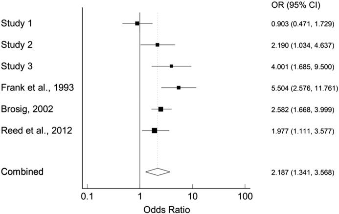

## Abstract

Humans form impressions and make social judgments about others based on information that is quickly and easily available, such as facial and vocal traits. The evolutionary function of impression formation and social judgment mechanisms have received limited attention in psychology research; we argue that their function is to accurately forecast the behavior of others. There is some evidence for the predictive accuracy of social judgments, but much of it comes from situations where there is little incentive to deceive, which limits applicability to questions of the function of such mechanisms. A classic experiment that avoids this problem was conducted by R. H. Frank, T. Gilovich, and D. T. Regan (1993); their participants predicted each other's Prisoner's Dilemma Game decisions with above-chance accuracy after a short interaction period, knowing the game would follow. We report three original studies that replicate these aspects of the methods of Frank et al. (1993) and reanalyze data from all known replications. Our meta-analysis of these studies confirms the original report: humans can predict each other's Prisoner's Dilemma decisions after a brief interaction with people who have incentive to deceive.

## Important figure

